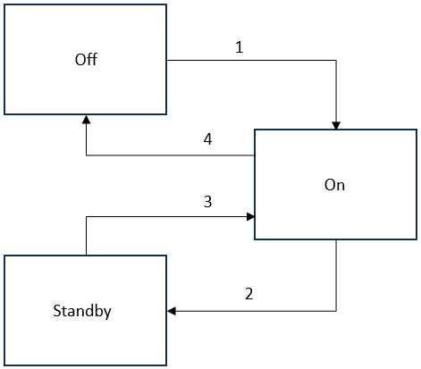

# Powering On/Powering Off/Setting to Standby

| WARNING | |
| --- | --- |
|  | UNINTENDED EQUIPMENT OPERATION  Verify that your machine/process is in a defined safe state before changing the power state of the controller.  Failure to follow these instructions can result in death, serious injury, or equipment damage. |

## Introduction

You can power the controller on and off or set it to standby using either the power button on the front face of the controller or the inputs **P4: PWR\_REM** and **P5: PWR\_RTN** of connector CN2:

## Power States and Power State Transitions

The following figure presents the power states and power state transitions of the controller:

Power states of the controller:

| Power State | Description |
| --- | --- |
| Off | This is the de-energized state of the controller. In this state, the controller still draws an input power of approximately up to 0.3 W. |
| On | This is the energized state of the controller. |
| Standby | This is the standby state of the controller. In this state, the RAM context for the operating system of the industrial PC (MN660P only) is maintained. Windows is in sleep mode. VxWorks (motion control) is disabled. |

Power state transitions of the controller:

| Power state transition | Description |
| --- | --- |
| 1 | **Off to On**  Using the button:   * Press for less than two seconds.   Using the input:   * Set to HIGH and back to LOW within less than two seconds.   The controller restarts.  NOTE: If you have [powered off](PoweringOnoff-15C34DB6.html) the controller (power state transition 4), wait for at least three seconds before powering it on again. The controller does not boot if less than three seconds pass between the last power off (power state transition 4) and the next power on (power state transition 1). |
| 2 | **On to Standby**  Using the button:   * Press for less than two seconds.   Using the input:   * Set to HIGH and back to LOW within less than two seconds.   The controller is set to the power state Standby. The RAM is maintained. VxWorks (motion control) is disabled. Windows (MN660P only) goes to sleep mode. |
| 3 | **Standby to On**  Using the button:   * Press for less than two seconds.   Using the input:   * Set to HIGH and back to LOW within less than two seconds.   The industrial PC (MN660P only) restores Windows from the last power on state without going through the restart routine. |
| 4 | **On to Off**  Using the button:   * Press for longer than three seconds.   Using the input:   * Set to HIGH for longer than three seconds and then back to LOW.   The controller stops. |

## Boot Sequence

M660 controllers scan the hardware for a bootable medium in the following default order:

1. SD card
2. USB drive(s)
3. Solid State Disk (SSD, hard drive)

**SD card**

If an SD card is found (MN660C), the controller starts the hypervisor and boots VxWorks for motion control from the SD card. VxWorks can only be booted from the SD card.

The controller then searches for a bootable operating system for the industrial PC on the USB drives and the SSD.

**USB drives**

If no SD card is found or if it does not contain a bootable operating system, the controller searches the USB drives for a bootable operating system for the industrial PC in this order:

1. USB 3.2 Gen 1 Type-A
2. USB 3.2 Gen 2 Type-C

NOTE: It is not possible to boot from the internal USB 2.0 Type-A.

**SSD**

If no SD card and no USB drive are found or if these storage media do not contain a bootable operating system, the controller (MN660P only) searches the SSDs for a bootable operating system for the industrial PC.

  

You can modify the boot sequence via the BIOS.

NOTE: The SD card is referred to as USB port 7 in the BIOS.

NOTE: Verify that the boot medium is not write-protected. Do not remove the boot medium during operation of the controller.

EIO0000005519.02