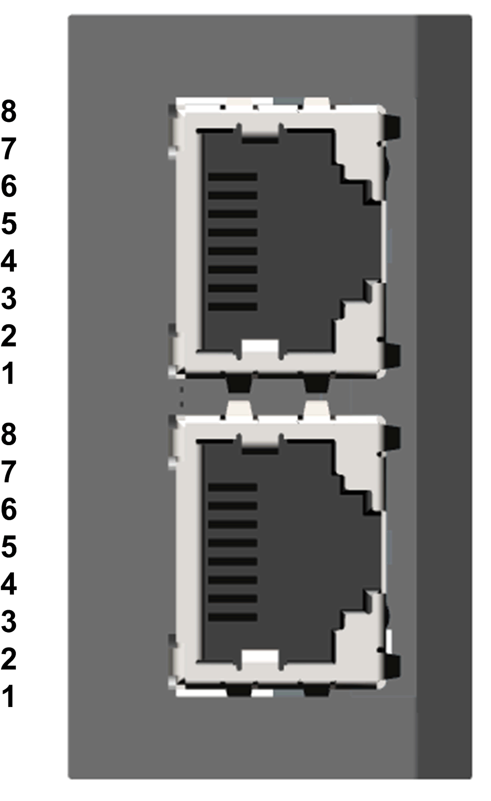

# Pin Layout

Pin Layout

The drive is equipped with 2 RJ45 female sockets for Sercos III connection.

The table provides the pin out details of each RJ45 connector:

| Pin | Signal | Meaning |
| --- | --- | --- |
| 1 | Tx+ | Ethernet transmit line + |
| 2 | Tx- | Ethernet transmit line – |
| 3 | Rx+ | Ethernet receive line + |
| 4...5 | − | − |
| 6 | Rx- | Ethernet receive line - |
| 7...8 | − | − |