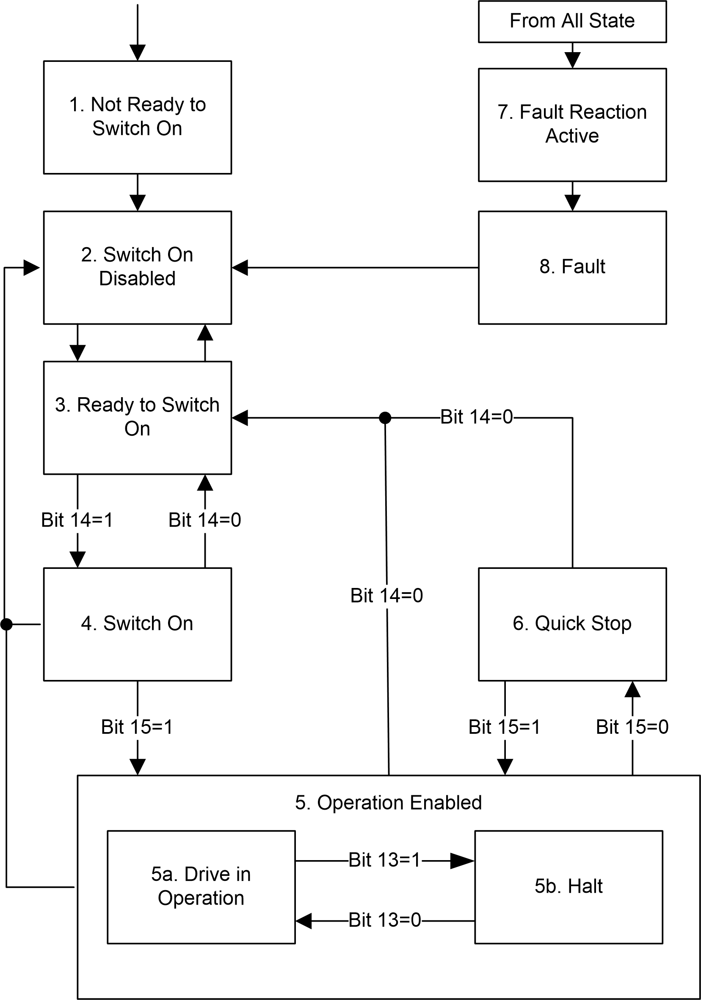

# State Diagram

State Diagram

After switching on and when an operating mode is started, the product goes through a number of operating states.

The state diagram (state machine) shows the relationships between the operating states and the state transitions. The operating states are internally monitored and influenced by monitoring functions.

The following figure shows the Sercos III state diagram:

