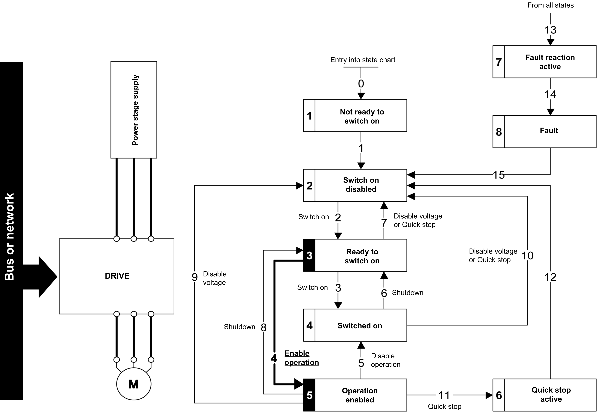

# Step 2

Step 2

oCheck that the drive is in the operating state 3 - Ready to switch on.

oThen apply the 4 - Enable operation command.

oThe motor can be controlled (send a reference value not equal to zero).

NOTE: It is possible, but not necessary to apply the 3 - Switch on command followed by the 4 - Enable Operation command to switch successively into the operating states 3 - Ready to Switch on,  4 - Switched on and then 5 - Operation Enabled. The 4 - Enable operation command is sufficient.