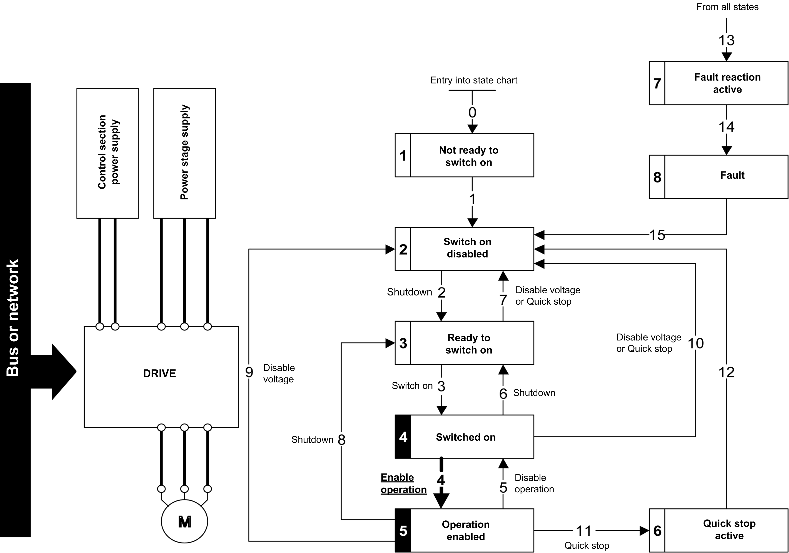

# Step 3

Step 3

oCheck that the drive is in the operating state 4 - Switched on.

oThen apply the 4 - Enable operation command.

oThe motor can be controlled (send a reference value not equal to zero).

oIf the power stage supply is still not present in the operating state 4 - Switched on after a time delay [Mains V. time out] (LCt), the drive triggers an error [Input Contactor] (LCF).

