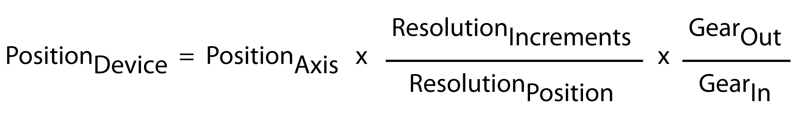

# Overview

Overview

The parameters of the parameter group Scaling are used to specify the ratio between motor rotation and axis movement according to the following equation:

The following descriptions of the individual parameters provide further details.