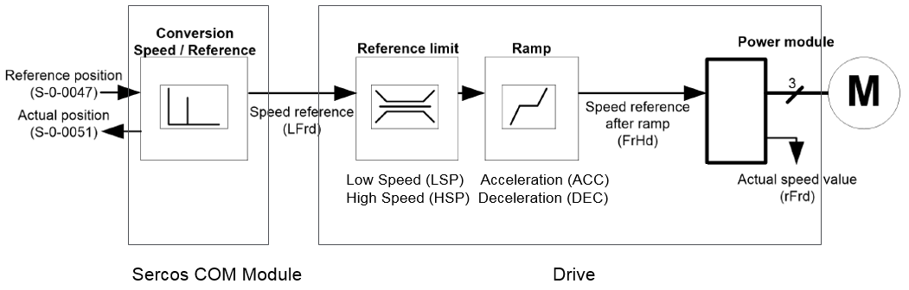

# Overview

Overview

The graphic illustrates the functional flow inside the ATV340S:

The values of the reference limit parameters Low Speed (LSP) and High Speed (HSP) in the drive are provided in 1/s.

LSP must be set to 0. HSP must be set to the maximum value.

NOTE: Set the ramp parameters in the drive according to the mechanical constraints of the machine by using the graphical keypad or the SoMove software. (For further information, refer to the ATV340S Hardware Guide, and for additional information on how to use SoMove, refer to the [Schneider Electric SoMove website](https://www.se.com/us/en/product-range/2714-somove/?subNodeId=12367273265en_US).)

The values of the ramp parameters for acceleration (ACC) and for deceleration (DEC) in the drive are provided in s.

ACC must be set to 0. DEC must be set to the mechanical limit of the axis.

The fast stop ramp is generated by division with the drive parameter DCF. The ramp divider DCF must be set to 1 using the PD\_PacDriveLib library (for further information, refer to the [PD\_PacDriveLib Library Guide](../../../../../../api/crossBook?lang=en-US&virtualBookName=PD.Lib.PacDriveLib&topicID=D_SE_0087815_13)).