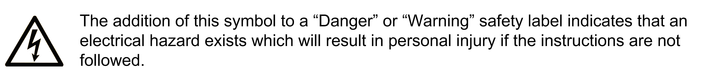
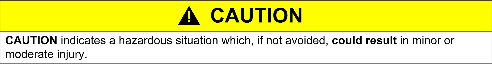

# Important Information

Important Information

NOTICE

Read these instructions carefully, and look at the equipment to become familiar with the device before trying to install, operate, service, or maintain it. The following special messages may appear throughout this documentation or on the equipment to warn of potential hazards or to call attention to information that clarifies or simplifies a procedure.

PLEASE NOTE

Electrical equipment should be installed, operated, serviced, and maintained only by qualified personnel. No responsibility is assumed by Schneider Electric for any consequences arising out of the use of this material.

A qualified person is one who has skills and knowledge related to the construction and operation of electrical equipment and its installation, and has received safety training to recognize and avoid the hazards involved.

Qualification Of Personnel

Only appropriately trained persons who are familiar with and understand the contents of this manual and all other pertinent product documentation are authorized to work on and with this product. In addition, these persons must have received safety training to recognize and avoid hazards involved. These persons must have sufficient technical training, knowledge and experience and be able to foresee and detect potential hazards that may be caused by using the product, by changing the settings and by the mechanical, electrical and electronic equipment of the entire system in which the product is used. All persons working on and with the product must be fully familiar with all applicable standards, directives, and accident prevention regulations when performing such work.

Intended Use

This product is a drive for three-phase synchronous, reluctance and asynchronous motors and intended for industrial use according to this manual. The product may only be used in compliance with all applicable safety standard and local regulations and directives, the specified requirements and the technical data. The product must be installed outside the hazardous ATEX zone. Prior to using the product, you must perform a risk assessment in view of the planned application. Based on the results, the appropriate safety measures must be implemented. Since the product is used as a component in an entire system, you must ensure the safety of persons by means of the design of this entire system (for example, machine design). Any use other than the use explicitly permitted is prohibited and can result in hazards.

Product Related Information

Read and understand these instructions before performing any procedure with this drive.

|  |
| --- |
| DangerElectrical_Color.gifDanger_Color.gifDANGER |
| HAZARD OF ELECTRIC SHOCK, EXPLOSION OR ARC FLASH |
| oOnly appropriately trained persons who are familiar with and understand the contents of this manual and all other pertinent product documentation and who have received safety training to recognize and avoid hazards involved are authorized to work on and with this drive system. Installation, adjustment, repair and maintenance must be performed by qualified personnel.  oThe system integrator is responsible for compliance with all local and national electrical code requirements as well as all other applicable regulations with respect to grounding of all equipment.  oMany components of the product, including the printed circuit boards, operate with mains voltage.  oOnly use properly rated, electrically insulated tools and measuring equipment.  oDo not touch unshielded components or terminals with voltage present.  oMotors can generate voltage when the shaft is rotated. Prior to performing any type of work on the drive system, block the motor shaft to prevent rotation.  oAC voltage can couple voltage to unused conductors in the motor cable. Insulate both ends of unused conductors of the motor cable.  oDo not short across the DC bus terminals or the DC bus capacitors or the braking resistor terminals.  oBefore performing work on the drive system:  oDisconnect all power, including external control power that may be present. Take into account that the circuit breaker or main switch does not de-energize all circuits.  oPlace a Do Not Turn On label on all power switches related to the drive system.  oLock all power switches in the open position.  oWait 15 minutes to allow the DC bus capacitors to discharge.  oFollow the instructions given in the chapter "Verifying the Absence of Voltage" in the installation manual of the product.  oBefore applying voltage to the drive system:  oVerify that the work has been completed and that the entire installation cannot cause hazards.  oIf the mains input terminals and the motor output terminals have been grounded and short-circuited, remove the ground and the short circuits on the mains input terminals and the motor output terminals.  oVerify proper grounding of all equipment.  oVerify that all protective equipment such as covers, doors, grids is installed and/or closed. |
| Failure to follow these instructions will result in death or serious injury. |

Drive systems may perform unexpected movements because of incorrect wiring, incorrect settings, incorrect data or other errors.

|  |
| --- |
| Warning_Color.gifWARNING |
| UNANTICIPATED EQUIPMENT OPERATION |
| oCarefully install the wiring in accordance with the EMC requirements.  oDo not operate the product with unknown or unsuitable settings or data.  oPerform a comprehensive commissioning test. |
| Failure to follow these instructions can result in death, serious injury, or equipment damage. |

Damaged products or accessories may cause electric shock or unanticipated equipment operation.

|  |
| --- |
| DangerElectrical_Color.gifDanger_Color.gifDANGER |
| ELECTRIC SHOCK OR UNANTICIPATED EQUIPMENT OPERATION |
| Do not use damaged products or accessories. |
| Failure to follow these instructions will result in death or serious injury. |

Contact your local Schneider Electric sales office if you detect any damage whatsoever.

|  |
| --- |
| Warning_Color.gifWARNING |
| LOSS OF CONTROL |
| oThe designer of any control scheme must consider the potential failure modes of control paths and, for critical control functions, provide a means to achieve a safe state during and after a path failure. Examples of critical control functions are emergency stop, overtravel stop, power outage and restart.  oSeparate or redundant control paths must be provided for critical control functions.  oSystem control paths may include communication links. Consideration must be given to the implications of unanticipated transmission delays or failures of the link.  oObserve all accident prevention regulations and local safety guidelines (1).  oEach implementation of the product must be individually and thoroughly tested for proper operation before being placed into service. |
| Failure to follow these instructions can result in death, serious injury, or equipment damage. |

(1) For USA: Additional information, refer to NEMA ICS 1.1 (latest edition), Safety Guidelines for the Application, Installation, and Maintenance of Solid State Control and to NEMA ICS 7.1 (latest edition), Safety Standards for Construction and Guide for Selection, Installation and Operation of Adjustable-Speed Drive Systems.

|  |
| --- |
| NOTICE |
| DESTRUCTION DUE TO INCORRECT MAINS VOLTAGE |
| Before switching on and configuring the product, verify that it is approved for the mains voltage. |
| Failure to follow these instructions can result in equipment damage. |

The temperature of the products described in this manual may exceed 80 °C (176 °F) during operation.

|  |
| --- |
| Warning_Color.gifWARNING |
| HOT SURFACES |
| oEnsure that any contact with hot surfaces is avoided.  oDo not allow flammable or heat-sensitive parts in the immediate vicinity of hot surfaces.  oVerify that the product has sufficiently cooled down before handling it.  oVerify that the heat dissipation is sufficient by performing a test run under maximum load conditions. |
| Failure to follow these instructions can result in death, serious injury, or equipment damage. |

This equipment has been designed to operate outside of any hazardous location. Only install this equipment in zones known to be free of a hazardous atmosphere.

|  |
| --- |
| Danger_Color.gifDANGER |
| POTENTIAL FOR EXPLOSION |
| Install and use this equipment in non-hazardous locations only. |
| Failure to follow these instructions will result in death or serious injury. |

Machines, controllers, and related equipment are usually integrated into networks. Unauthorized persons and malware may gain access to the machine as well as to other devices on the network/fieldbus of the machine and connected networks via insufficiently secure access to software and networks.

|  |
| --- |
| Warning_Color.gifWARNING |
| UNAUTHORIZED ACCESS TO THE MACHINE VIA SOFTWARE AND NETWORKS |
| oIn your hazard and risk analysis, consider all hazards that result from access to and operation on the network/fieldbus and develop an appropriate cyber security concept.  oVerify that the hardware infrastructure and the software infrastructure into which the machine is integrated as well as all organizational measures and rules covering access to this infrastructure consider the results of the hazard and risk analysis and are implemented according to best practices and standards covering IT security and cyber security (such as: ISO/IEC 27000 series, Common Criteria for Information Technology Security Evaluation, ISO/ IEC 15408, IEC 62351, ISA/IEC 62443, NIST Cybersecurity Framework, Information Security Forum - Standard of Good Practice for Information Security).  o Verify the effectiveness of your IT security and cyber security systems using appropriate, proven methods. |
| Failure to follow these instructions can result in death, serious injury, or equipment damage. |

|  |
| --- |
| Warning_Color.gifWARNING |
| LOSS OF CONTROL |
| Perform a comprehensive commissioning test to verify that communication monitoring properly detects communication interruptions |
| Failure to follow these instructions can result in death, serious injury, or equipment damage. |

PHA33735.01

© 2019 Schneider Electric. All rights reserved.