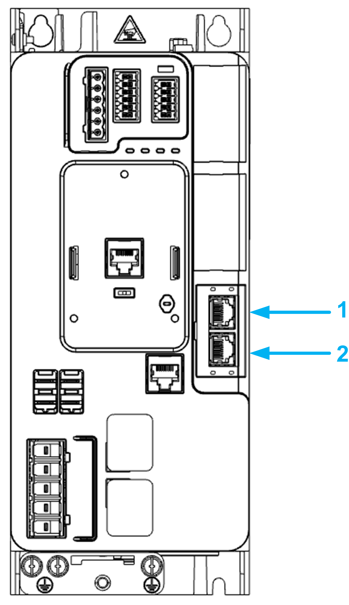

# Presentation

Presentation

Hardware Overview

General

The drive embeds a Sercos III dual port adapter that can be used in industrial Sercos III fieldbuses.

The following figure shows the location of the Sercos III dual port adapter:

1   Sercos III port 1.

2   Sercos III port 2

PHA33735.01

© 2019 Schneider Electric. All rights reserved.