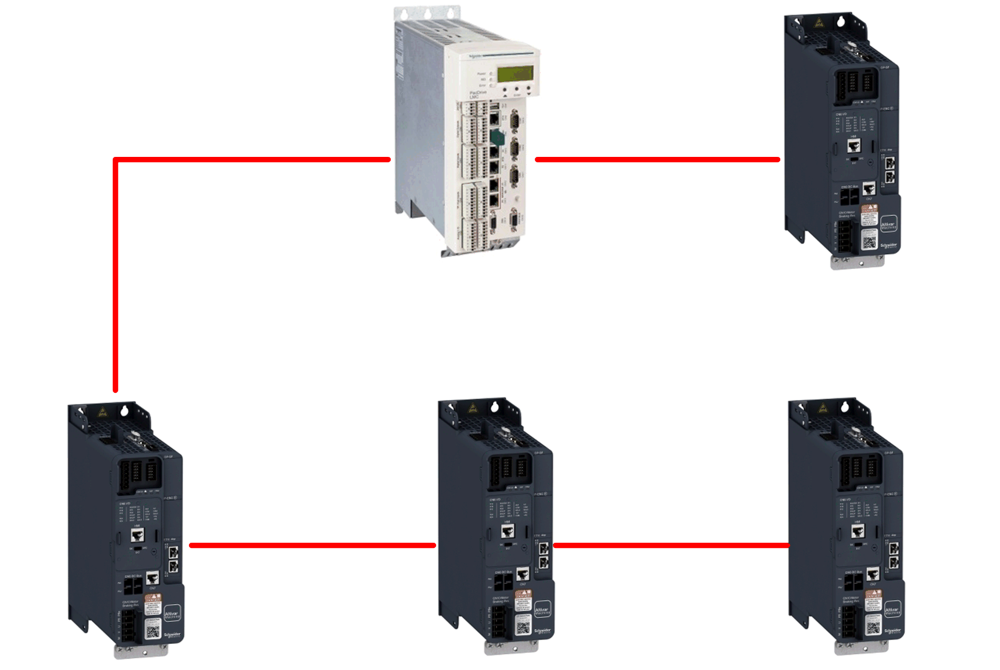
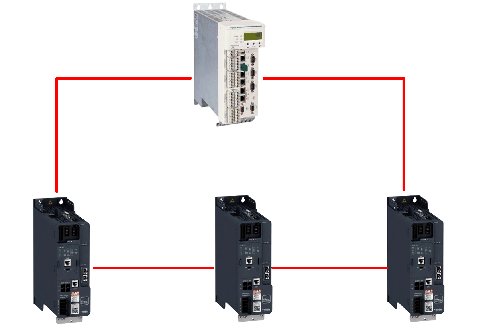

# Cable Routing Practice

Cable Routing Practice

Installation Topology

The Sercos III adapter enables several wiring solutions:

oLine or Double-Line topology:

The Double-Line topology must be used with Sercos Address as Sercos Identification mode. If the Sercos Identification mode is done with Topology Addresses, the double-line cannot be used.

NOTE: In line or double line topology, if one drive is turned off, a [Embd Eth Com Interrupt] EtHF error is triggered in he other drives connected to the same topology.

oRing topology

NOTE: In ring topology, the Sercos network communication is robust to one cable loss between two slaves or between a Master and a Slave.

NOTE: Irrespective of the topology, to keep the integrity of Sercos network when one or more drives are powered off, add an external permanent 24 Vdc supply to the control block of the drive.

PHA33735.01

© 2019 Schneider Electric. All rights reserved.