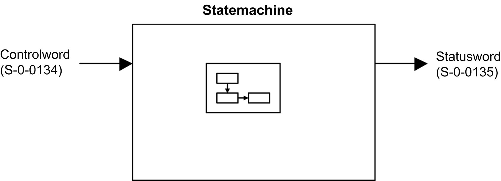
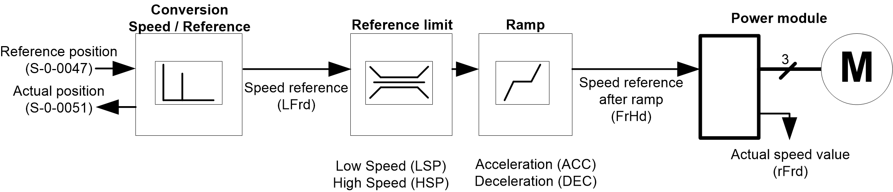

# Functional Description

Functional Description

Introduction

Drive operation involves two main functions, which are illustrated in the diagrams below.

Sercos III

The following figure shows the control diagram for drive operation:

Regarding the control mode, a reference position command (S-0-0047) is sent to the drive. In the drive, this reference position is converted in speed regarding the limitations. In the embedded Sercos III module, the reference position is copied into the actual position (S-0-0051). At the next cycle, the drive gives back this actual position (S-0-0051).

NOTE: The CIA402 operating state is used internally to the drive. Through Sercos III communication, only Sercos state diagram is available. In the drive a conversion is done between Sercos III and CIA402.

PHA33735.01

© 2019 Schneider Electric. All rights reserved.