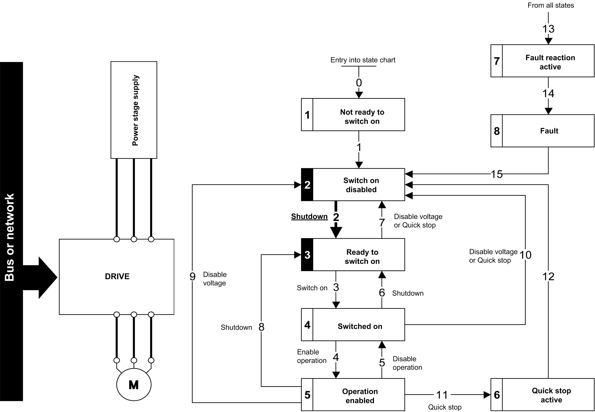

# Starting Sequence for a Drive Powered by the Power Stage Supply

Starting Sequence for a Drive Powered by the Power Stage Supply

Description

Both the power and control stages are powered by the power stage supply.

If power is supplied to the control stage, it has to be supplied to the power stage as well.

The following sequence must be applied:

Step 1

Apply the 2 - Shut down command

Step 2

oCheck that the drive is in the operating state 3 - Ready to switch on.

oThen apply the 4 - Enable operation command.

oThe motor can be controlled (send a reference value not equal to zero).

NOTE: It is possible, but not necessary to apply the 3 - Switch on command followed by the 4 - Enable Operation command to switch successively into the operating states 3 - Ready to Switch on,  4 - Switched on and then 5 - Operation Enabled. The 4 - Enable operation command is sufficient.

PHA33735.01

© 2019 Schneider Electric. All rights reserved.