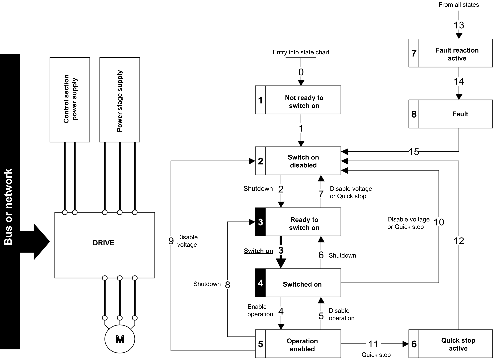

# Starting Sequence for a Drive with Separate Control Stage

Starting Sequence for a Drive with Separate Control Stage

Description

Power is supplied separately to the power and control stages.

If power is supplied to the control stage, it does not have to be supplied to the power stage as well.

The following sequence must be applied:

Step 1

oThe power stage supply is not necessarily present.

oApply the 2 - Shut down command

Step 2

oCheck that the drive is in the operating state 3 - Ready to switch on.

oCheck that the power stage supply is present (Voltage enabled of the status word).

| Power Stage Supply |  | Status Word |
| --- | --- | --- |
| Not present | (nLP) | 21 hex |
| Present | (rdY) | 31 hex |

oApply the 3 - Switch on  command

Step 3

oCheck that the drive is in the operating state 4 - Switched on.

oThen apply the 4 - Enable operation command.

oThe motor can be controlled (send a reference value not equal to zero).

oIf the power stage supply is still not present in the operating state 4 - Switched on after a time delay [Mains V. time out] (LCt), the drive triggers an error [Input Contactor] (LCF).

PHA33735.01

© 2019 Schneider Electric. All rights reserved.