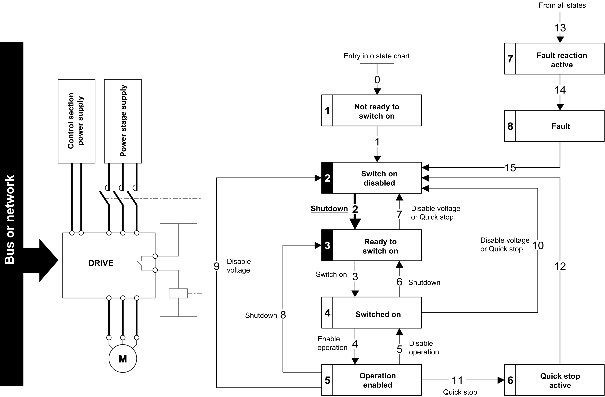
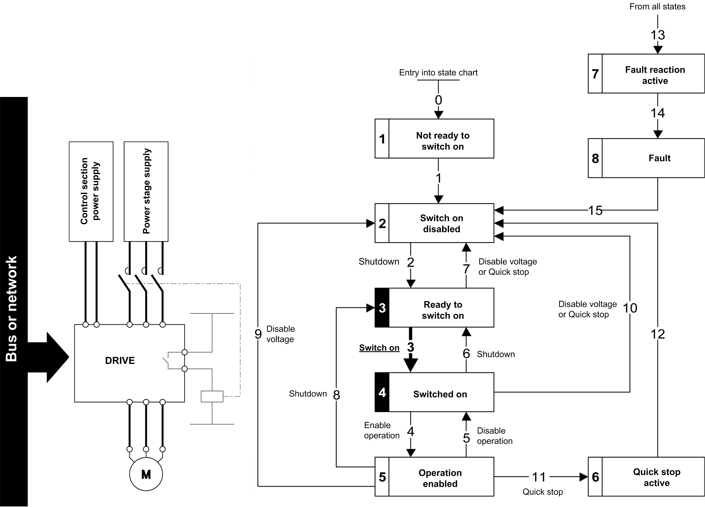

# Starting Sequence for a Drive with Mains Contactor Control

Starting Sequence for a Drive with Mains Contactor Control

Description

Power is supplied separately to the power and control stages.

If power is supplied to the control stage, it does not have to be supplied to the power stage as well. The drive controls the mains contactor.

The following sequence must be applied:

Step 1

oThe power stage supply is not present as the mains contactor is not being controlled.

oApply the 2 - Shutdown command.

Step 2

oCheck that the drive is in the operating state 3 - Ready to switch on.

oApply the 3 - Switch on command, which closes the mains contactor and switch on the power stage supply.

PHA33735.01

© 2019 Schneider Electric. All rights reserved.