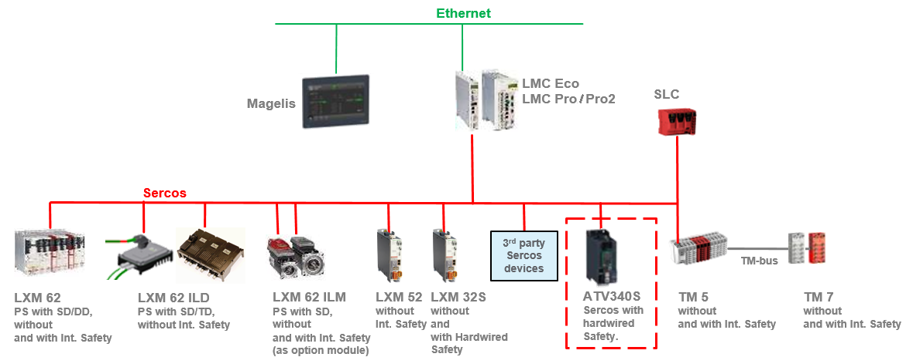

# Application with ATV340S Variable Speed Drive - System Overview

Application with ATV340S Variable Speed Drive - System Overview

Overview

The ATV340S, a variable speed drive with a Sercos III interface, is designed and tested for a PacDrive system architecture.

Motion Machine Architecture

The figure displays an architecture with one automation bus for logic, motion, and safety-related devices:

The ATV340S supports the function open loop speed control as a SercDrive object without license points.

The PacDrive logic motion controller generates the motion profile (cyclic position set points over Sercos III).

The Sercos III communication module in the ATV340S converts the position into a speed and passes it to the drive.

EIO0000004057.00

© 2019 Schneider Electric. All rights reserved.