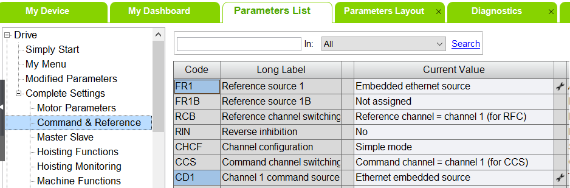

# First Commissioning

First Commissioning

First Commissioning with SoMove

Overview

It is a good practice to use the SoMove software for the first commissioning of the ATV340S with a motor. For further information, refer to the [Schneider Electric SoMove website](https://www.se.com/us/en/product-range/2714-somove/?subNodeId=12367273265en_US).

SoMove Settings

The parameters FR1 and CD1 are by default set to Embedded ethernet source / Ethernet embedded source.

Verify the settings in the Parameters List tab as indicated in the graphic:

EIO0000004057.00

© 2019 Schneider Electric. All rights reserved.