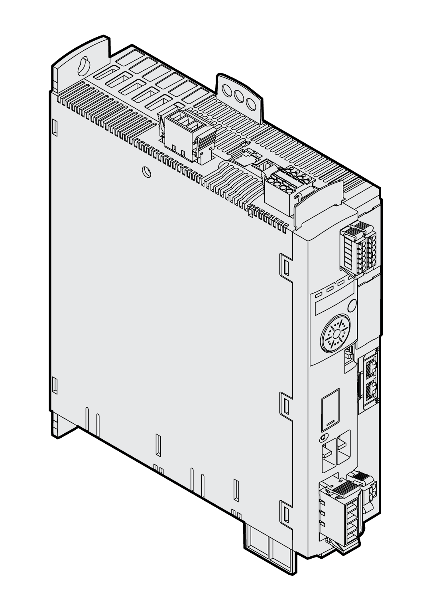

# Device Overview

## General

The Lexium 32 product family consists of various servo drive models that cover different application areas. Together with Lexium BMH servo motors or Lexium BSH servo motors as well as a comprehensive portfolio of options and accessories, the drives are ideally suited to implement compact, high-performance drive solutions for a wide range of power requirements.

## Lexium Servo Drive LXM32S

This product manual describes the LXM32S servo drive.

Overview of some of the features of the servo drive:

* Communication interface for SERCOS III.
* An optional encoder module allows you to add a second encoder interface for digital encoders, analog encoders or resolvers.
* The product is commissioned via the integrated HMI, the external graphic display terminal or a PC with commissioning software.
* The safety function "Safe Torque Off" (STO) as per IEC 61800-5-2 is integrated into the drive. The optional safety module eSM offers additional safety functions.
* A memory card slot is provided for backup and copying of parameters and fast device replacement.

0198441114060.03

© 2021

Schneider Electric.

All rights reserved.