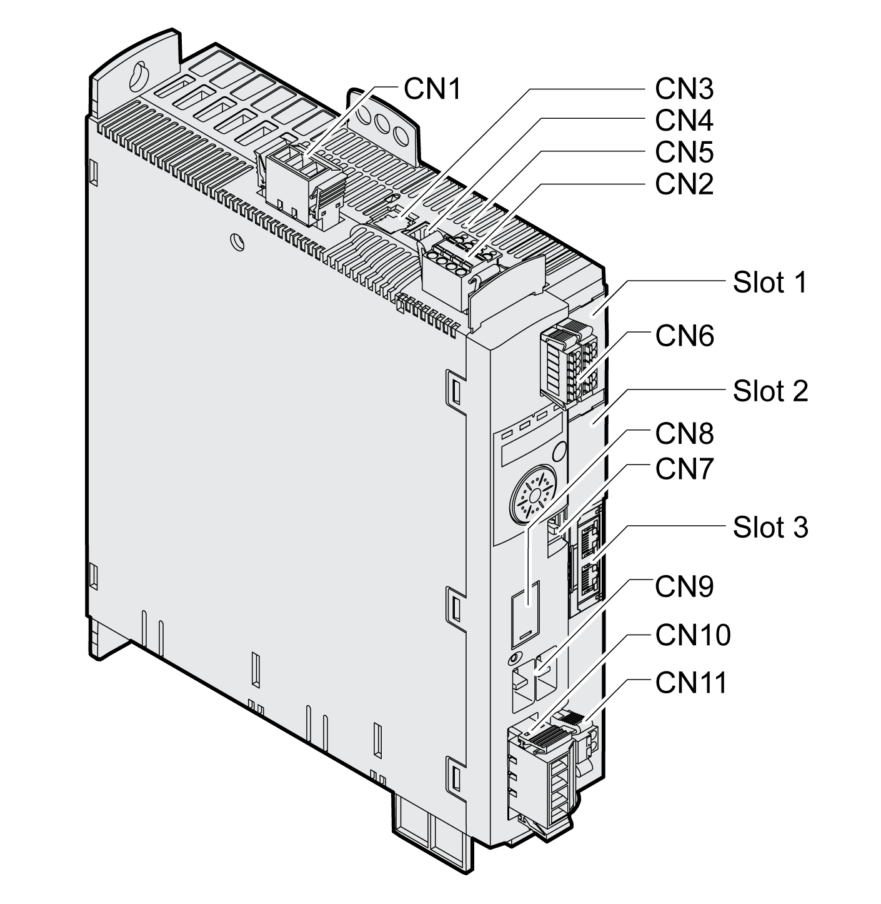

# Components and Interfaces

## Overview

**CN1** Power stage supply

**CN2** 24 Vdc control supply and safety function STO

**CN3** Motor encoder (Encoder 1)

**CN4** PTO (Pulse Train Out) - ESIM (encoder simulation)

**CN5** PTI (Pulse Train In) - P/D, A/B or CW/CCW signals

**CN6** 6 digital inputs and 3 digital outputs

**CN7** Modbus (commissioning interface)

**CN8** External braking resistor

**CN9** DC bus

**CN10** Motor phases

**CN11** Motor holding brake

**Slot 1** Slot for safety module

**Slot 2** Slot for encoder module (Encoder 2)

**Slot 3** Fieldbus SERCOS III

0198441114060.03

© 2021

Schneider Electric.

All rights reserved.