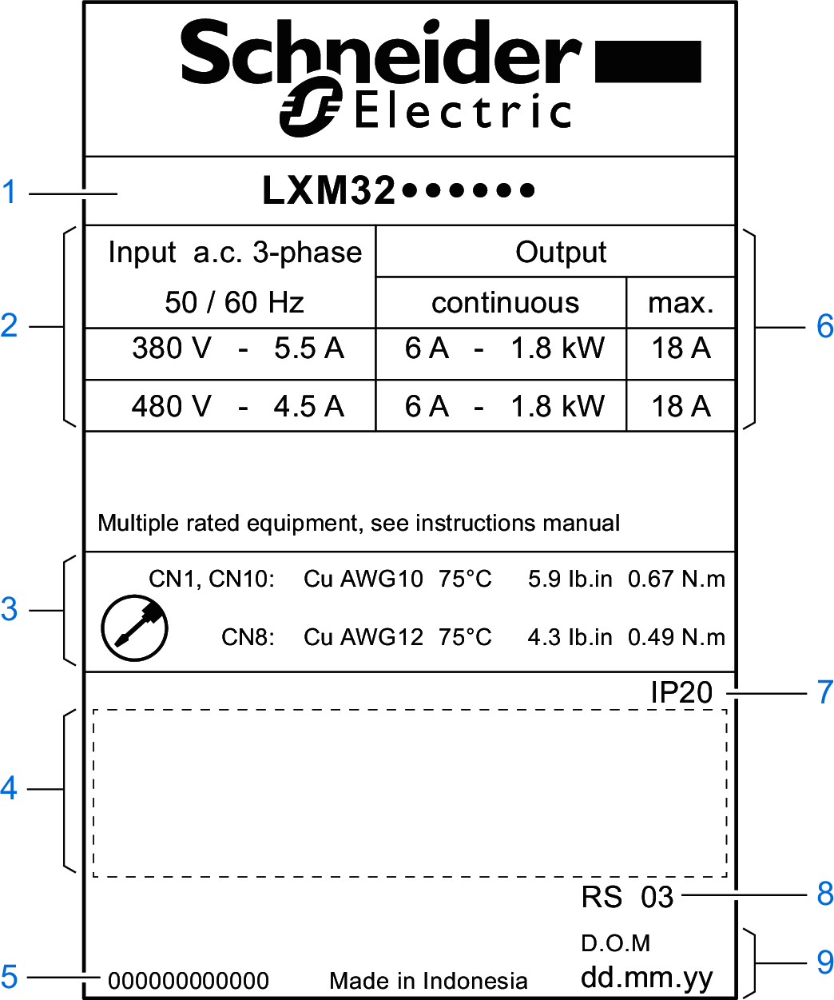

# Nameplate

## Description

The nameplate contains the following data:

**1** Product type, see [Type Code](TypeCode-A72B6006.html)

**2** Power stage supply

**3** Cable specifications and tightening torque

**4** Certifications (see product catalog)

**5** Serial number

**6** Output power

**7** Degree of protection

**8** Hardware version

**9** Date of manufacture

0198441114060.03

© 2021

Schneider Electric.

All rights reserved.