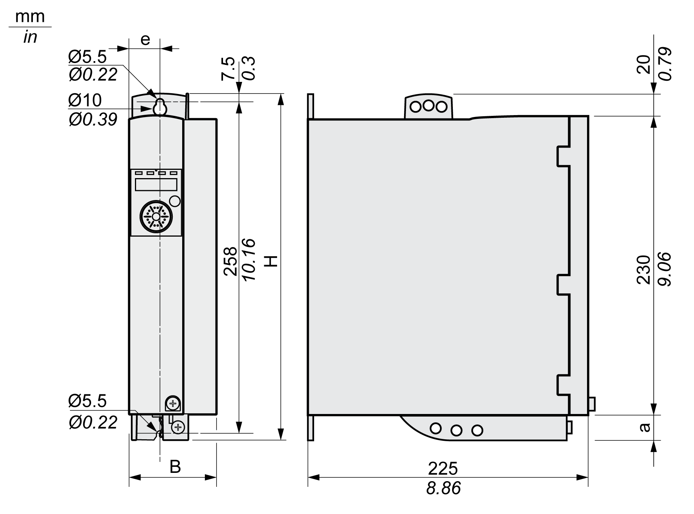
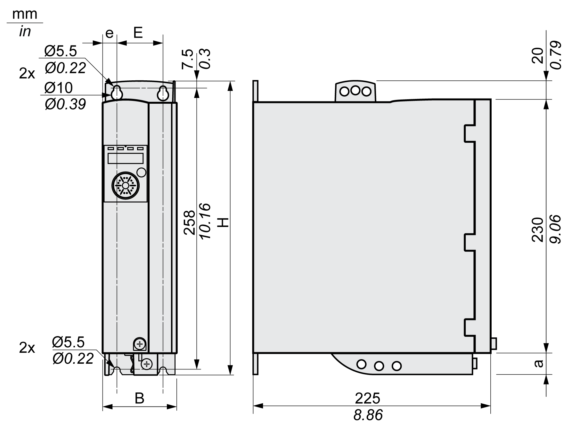

# Dimensions

## Dimensions LXM32•U45, LXM32•U60, LXM32•U90, LXM32•D12, LXM32•D18 and LXM32•D30M2

| Characteristic | Unit | Value | |
| --- | --- | --- | --- |
| LXM32•U45, LXM32•U60, LXM32•U90 | LXM32•D12, LXM32•D18, LXM32•D30M2 |
| B | mm (in) | 68 ±1 (2.68 ±0.04) | 68 ±1 (2.68 ±0.04) |
| H | mm (in) | 270 (10.63) | 270 (10.63) |
| e | mm (in) | 24 (0.94) | 24 (0.94) |
| a | mm (in) | 20 (0.79) | 20 (0.79) |
| Type of cooling | - | Convection(1) | Fan 40 mm (1.57 in) |
| **(1)** Greater than 1 m/s | | | |

## Dimensions LXM32•D30N4 and LXM32•D72

| Characteristic | Unit | Value | |
| --- | --- | --- | --- |
| LXM32•D30N4 | LXM32•D72 |
| B | mm (in) | 68 ±1 (2.68 ±0.04) | 108 ±1 (4.25 ±0.04) |
| H | mm (in) | 270 (10.63) | 274 (10.79) |
| e | mm (in) | 13 (0.51) | 13 (0.51) |
| E | mm (in) | 42 (1.65) | 82 (3.23) |
| a | mm (in) | 20 (0.79) | 24 (0.94) |
| Type of cooling | - | Fan 60 mm (2.36 in) | Fan 80 mm (3.15 in) |

## Mass

| Characteristic | Unit | Value | | | | | |
| --- | --- | --- | --- | --- | --- | --- | --- |
| LXM32•U45 | LXM32•U60, LXM32•U90 | LXM32•D12, LXM32•D18M2 | LXM32•D18N4, LXM32•D30M2 | LXM32•D30N4 | LXM32•D72 |
| Mass | kg (lb) | 1.8 (3.97) | 1.9 (4.19) | 2.0 (4.41) | 2.2 (4.85) | 2.8 (6.17) | 4.9 (10.8) |

0198441114060.03

© 2021

Schneider Electric.

All rights reserved.