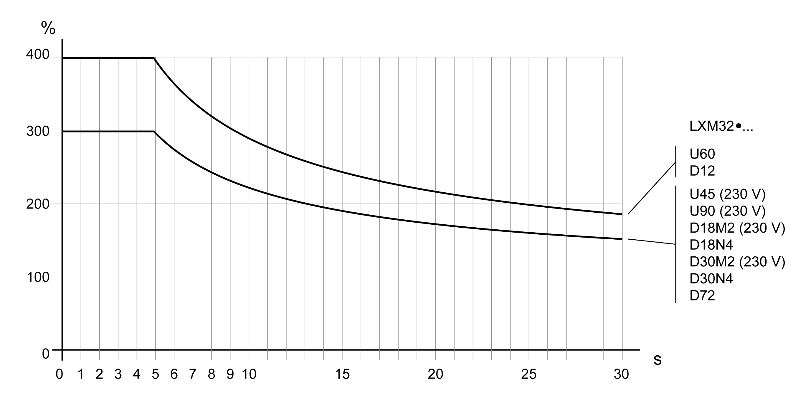
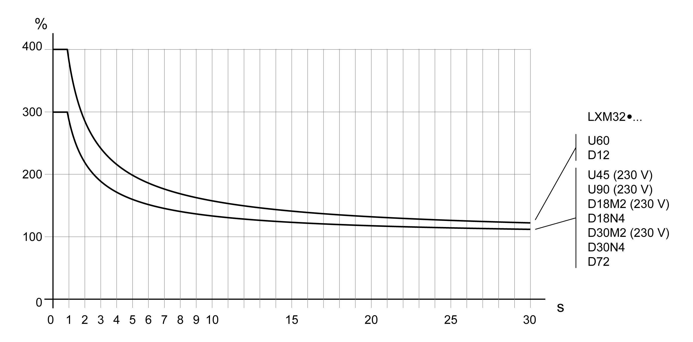

# Peak Output Currents

## Description

The device can provide the peak output current for a limited period of time. If the peak output current flows when the motor is at a standstill, the higher load on a single semiconductor switch causes the current limitation to become active earlier than when the motor moves.

The period of time for which the peak output current can be provided depends on the hardware version.

Peak output current with hardware version ≥RS03: 5 seconds

Peak output current with hardware version <RS03: 1 second

0198441114060.03

© 2021

Schneider Electric.

All rights reserved.