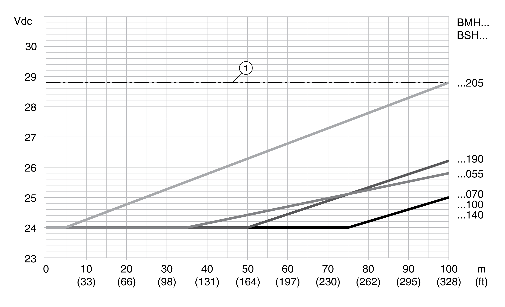

# 24 Vdc Control Supply

## Description

The 24 Vdc control supply must meet the requirements of IEC 61131-2 (PELV standard power supply unit):

| Characteristic | Unit | Value |
| --- | --- | --- |
| Input voltage | Vdc | 24 (-15/+20 %)(1) |
| Input current (without load) | A | ≤1(2) |
| Residual ripple | % | <5 |
| Inrush current |  | Charging current for capacitor C= 1.8 mF |
| **(1)** For connection of motors without holding brake. See figure below for motors with holding brake  **(2)** Input current: holding brake not considered. | | |

## 24 Vdc Control Supply in the Case of Motor with Holding Brake

If a motor with holding brake is connected, the 24 Vdc control supply must be adjusted according to the connected motor type, the motor cable length and the cross section of the wires for the holding brake. The following diagram applies to the motor cables available as accessories, see [Accessories and Spare Parts](AccessoriesAndSpareParts-C17F0DA3.html#AccessoriesAndSpareParts-C17F0DA3). See the diagram for the voltage that must be available at CN2 for releasing the holding brake. The voltage tolerance is ±5 %.

24 Vdc control supply in the case of motor with holding brake: the voltage depends on the motor type, the motor cable length and the conductor cross section.

**1** Maximum voltage of the 24 Vdc control supply

0198441114060.03

© 2021

Schneider Electric.

All rights reserved.