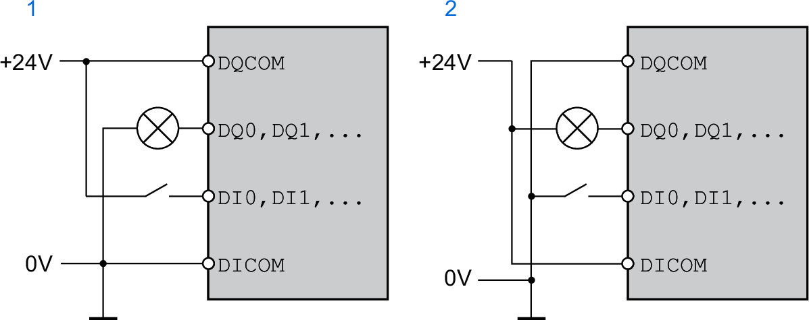

# Signals

## Logic Type

The digital inputs and outputs of this product can be wired to enable positive logic or negative logic.

| Logic type | Active state |
| --- | --- |
| (1) Positive logic | Output supplies current (source output)  Current flows to the input (sink input) |
| (2) Negative logic | Output draws current (sink output)  Current flows from the input (source input) |

Signal inputs are protected against reverse polarity, outputs are short-circuit protected. The inputs and outputs are functionally isolated.

Refer to [Logic Type](LogicType-BA473BF9.html#LogicType-BA473BF9) for more information on sinking, sourcing and positive and negative logic.

## Digital Input Signals 24 V

When wired as sinking inputs, the levels of the digital inputs comply with IEC 61131-2, type 1. The electrical characteristics are also valid when wired as sourcing inputs unless otherwise indicated.

| Characteristic | Unit | Value |
| --- | --- | --- |
| Input voltage - sinking inputs  Level 0  Level 1 | Vdc | -3 ... 5  15 ... 30 |
| Input voltage - sourcing inputs (at 24 Vdc)  Level 0  Level 1 | Vdc | >19  <9 |
| Input current (at 24 Vdc) | mA | 5 |
| Debounce time (software)(1)(2) | ms | 1.5 (default value) |
| Hardware switching time  Rising edge (level 0 -> 1)  Falling edge (level 1 -> 0) | µs | 15  150 |
| Jitter (capture inputs) | µs | <2 |
| **(1)** Adjustable via parameter (sampling period 250µs)  **(2)** If the capture inputs are used for capture then the debounce time is not applied. | | |

## Digital Output Signals 24 V

When wired as sourcing outputs, the levels of the digital outputs comply with IEC 61131-2. The electrical characteristics are also valid when wired as sinking outputs unless otherwise indicated.

| Characteristic | Unit | Value |
| --- | --- | --- |
| Nominal supply voltage | Vdc | 24 |
| Voltage range for supply voltage | Vdc | 19.2 ... 30 |
| Nominal output voltage - sourcing outputs | Vdc | 24 |
| Nominal output voltage - sinking outputs | Vdc | 0 |
| Voltage drop at 100 mA load | Vdc | ≤3 |
| Maximum current per output | mA | 100 |

## Input Signals Safety Function STO

The inputs for the safety function STO (inputs STO\_A and STO\_B) can only be wired for sinking inputs. Observe the information provided in section [Functional Safety](FunctionalSafety-C41F7D55.html#FunctionalSafety-C41F7D55).

| Characteristic | Unit | Value |
| --- | --- | --- |
| Input voltage  Level 0  Level 1 | Vdc | -3 ... 5  15 ... 30 |
| Input current (at 24 Vdc) | mA | 5 |
| Debounce time STO\_A and STO\_B | ms | >1 |
| Detection of signal differences between STO\_A and STO\_B | s | >1 |
| Response time of safety function STO | ms | ≤10 |

## Holding Brake Output CN11

The 24 Vdc holding brake of the BMH motor or the BSH motor can be connected to the output CN11. Data of output CN11:

| Characteristic | Unit | Value |
| --- | --- | --- |
| Output voltage(1) | V | Voltage at 24 Vdc control supply CN2 minus 0.8 V |
| Maximum switching current | A | 1.7 |
| Energy inductive load(2) | Ws | 1.5 |
| **(1)** See [24 Vdc Control Supply](VdcControlSupply-CC40A6EA.html#VdcControlSupply-CC40A6EA)  **(2)** Time between switch off procedures: > 1 s | | |

## Encoder Signals

The encoder signals comply with the Stegmann Hiperface specification.

| Characteristic | Unit | Value |
| --- | --- | --- |
| Output voltage for encoder | V | 10 |
| Output current for encoder | mA | 100 |
| SIN/COS input signal voltage range | - | 1 Vpp with 2.5 V offset,  0.5 Vpp at 100 kHz |
| Input resistance | Ω | 120 |

The output voltage is short-circuit protected and overload protected.

0198441114060.03

© 2021

Schneider Electric.

All rights reserved.