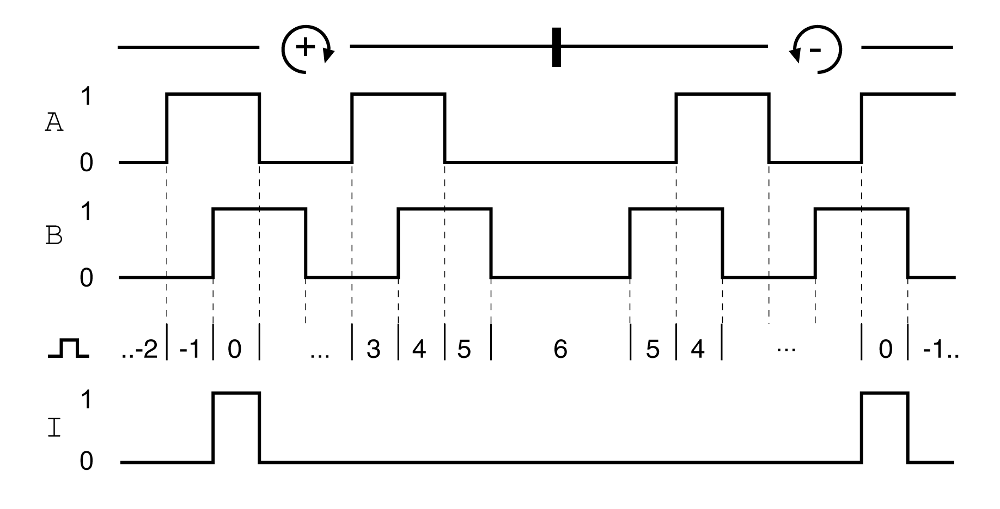

# Output PTO (CN4)

## Description

5 V signals are available at the PTO (Pulse Train Out, CN4) output. Depending on parameter PTO\_mode, these signals are ESIM signals (encoder simulation) or directly transmitted PTI input signals (P/D signals, A/B signals, CW/CCW signals). The PTO output signals can be used as PTI input signals for another device. The PTO output signals have 5 V, even if the PTI input signal is a 24 V signal.

## Output Signal PTO

The PTO output signals comply with the RS422 interface specification. Due to the input current of the optocoupler in the input circuit, a parallel connection of a driver output to several devices is not permitted.

The basic resolution of the encoder simulation at quadruple resolution is 4096 increments per revolution in the case of rotary motors.

Time chart with A, B and index pulse signal, counting forwards and backwards

| Characteristic | Unit | Value |
| --- | --- | --- |
| Logic level |  | As per RS422(1) |
| Output frequency per signal | kHz | ≤500 |
| Motor increments per second | Inc/s | ≤1.6 \* 106 |
| **(1)** Due to the input current of the optocoupler in the input circuit, a parallel connection of a driver output to several devices is not permitted. | | |

The device connected to the PTO output must be able to process the specified motor increments per second. Even at low velocities, (medium PTO frequency in the kHz range), edges may change at up to 1.6 MHz.

0198441114060.03

© 2021

Schneider Electric.

All rights reserved.