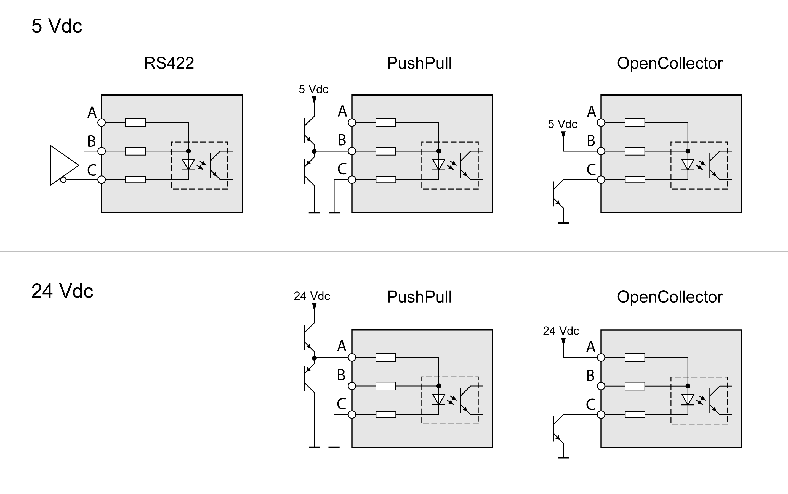
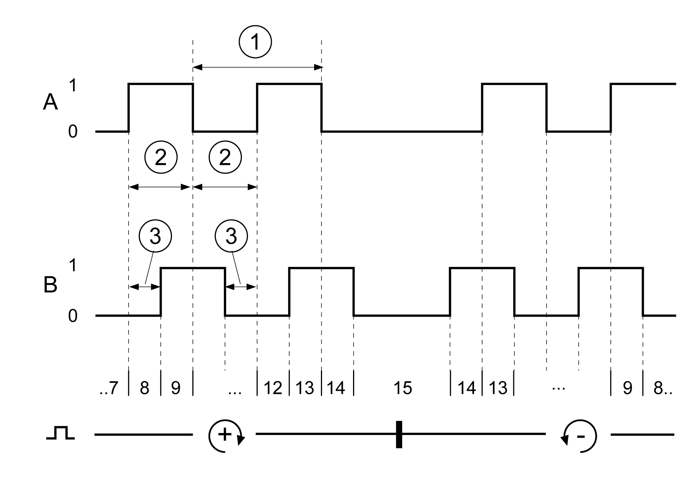
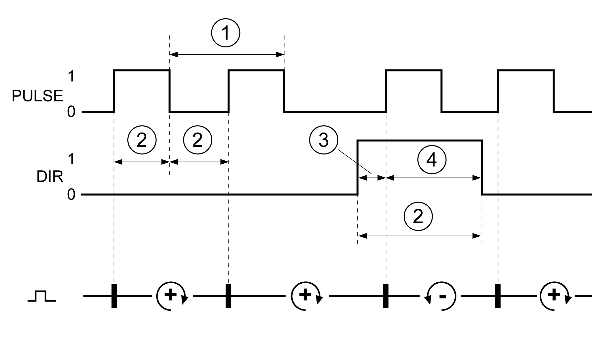
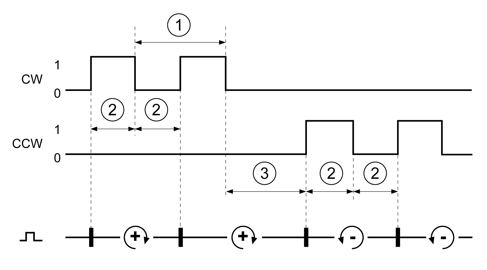

# Input PTI (CN5)

## Description

5 V signals or 24 V signals can be connected to the PTI (Pulse Train In) input.

The following signals can be connected:

* A/B signals (ENC\_A/ENC\_B)
* P/D signals (PULSE/DIR)
* CW/CCW signals (CW/CCW)

## Input Circuit and Selection of Method

The input circuit and the selected method affect the maximum permissible input frequency and the maximum permissible line length:

| Input circuit |  | RS422 | Push pull | Open collector |
| --- | --- | --- | --- | --- |
| Minimum input frequency with method position synchronization | Hz | 0 | 0 | 0 |
| Minimum input frequency with method velocity synchronization | Hz | 100 | 100 | 100 |
| Maximum input frequency | MHz | 1 | 0.2 | 0.01 |
| Maximum line length | m (ft) | 100 (328) | 10 (32.8) | 1 (3.28) |

Signal input circuits: RS422, Push Pull and Open Collector

| Input | Pin(1) | RS422(2) | 5V | 24V |
| --- | --- | --- | --- | --- |
| **A** | Pin 7 | Reserved | Reserved | PULSE(24V)  ENC\_A(24V)  CW(24V) |
| Pin 8 | Reserved | Reserved | DIR(24V)  ENC\_B(24V)  CCW(24V) |
| **B** | Pin 1 | PULSE(5V)  ENC\_A(5V)  CW(5V) | PULSE(5V)  ENC\_A(5V)  CW(5V) | Reserved |
| Pin4 | DIR(5V)  ENC\_B(5V)  CCW(5V) | DIR(5V)  ENC\_B(5V)  CCW(5V) | Reserved |
| **C** | Pin 2 | PULSE  ENC\_A  CW | PULSE  ENC\_A  CW | PULSE  ENC\_A  CW |
| Pin 5 | DIR  ENC\_B  CCW | DIR  ENC\_B  CCW | DIR  ENC\_B  CCW |
| **(1)** Observe the different pairing in the case of twisted pair:  Pin 1 / pin 2 and pin 4 / pin 5 for RS422 and 5V  pin 7 / pin 2 and pin 8 / pin 5 for 24V  **(2)** Due to the input current of the optocoupler in the input circuit, a parallel connection of a driver output to several devices is not permitted. | | | | |

## Function A/B Signals

External A/B signals can be counted at the PTI input.

| Signal | Value | Function |
| --- | --- | --- |
| Signal A before signal B | 0 -> 1 | Count in positive direction |
| Signal B before signal A | 0 -> 1 | Count in negative direction |

Time chart with A/B signal, counting forwards and backwards

| Times for pulse/direction | Minimum value |
| --- | --- |
| (1) Cycle duration A, B | 1 μs |
| (2) Pulse duration | 0.4 μs |
| (3) Lead time (A, B) | 200 ns |

## Function P/D Signals

External P/D signals can be counted at the PTI input.

| Signal | Value | Function |
| --- | --- | --- |
| PULSE  DIR | 0 -> 1  0 / open | Count in positive direction |
| PULSE  DIR | 0 -> 1  1 | Count in negative direction |

Time chart with pulse/direction signal

| Times for pulse/direction | Minimum value |
| --- | --- |
| (1) Cycle duration (pulse) | 1 μs |
| (2) Pulse duration (pulse) | 0.4 μs |
| (3) Lead time (Dir-Pulse) | 0 μs |
| (4) Hold time (Pulse-Dir) | 0.4 μs |

## Function CW/CCW Signals

External CW/CCW signals can be counted at the PTI input.

| Signal | Value | Function |
| --- | --- | --- |
| CW | 0 -> 1 | Count in positive direction |
| CCW | 0 -> 1 | Count in negative direction |

Time chart with "CW/CCW"

| Times for pulse/direction | Minimum value |
| --- | --- |
| (1) Cycle duration CW, CCW | 1 μs |
| (2) Pulse duration | 0.4 μs |
| (3) Lead time (CW-CCW, CCW-CW) | 0 μs |

0198441114060.03

© 2021

Schneider Electric.

All rights reserved.