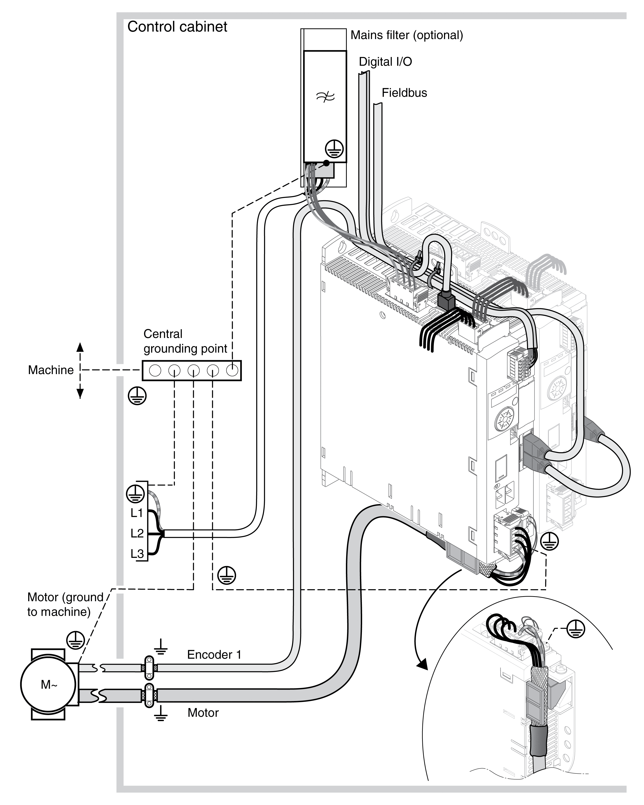

# General

## EMC-Compliant Wiring

This drive meets the EMC requirements according to the standard IEC 61800-3 if the measures described in this manual are implemented during installation.

Signal interference can cause unexpected responses of the drive system and of other equipment in the vicinity of the drive system.

| WARNING | |
| --- | --- |
|  | SIGNAL AND EQUIPMENT INTERFERENCE  * Install the wiring in accordance with the EMC requirements described in the present document. * Verify compliance with the EMC requirements described in the present document. * Verify compliance with all EMC regulations and requirements applicable in the country in which the product is to be operated and with all EMC regulations and requirements applicable at the installation site.  Failure to follow these instructions can result in death, serious injury, or equipment damage. |

| WARNING | |
| --- | --- |
|  | ELECTROMAGNETIC DISTURBANCES OF SIGNALS AND DEVICES  Use proper EMI shielding techniques to help prevent unintended device operation.  Failure to follow these instructions can result in death, serious injury, or equipment damage. |

See [Electromagnetic Emission](ElectromagneticEmission-BA38D58A.html#ElectromagneticEmission-BA38D58A) for the EMC categories.

Overview of wiring with EMC details

## EMC Requirements for the Control Cabinet

| EMC measures | Objective |
| --- | --- |
| Use mounting plates with good electrical conductivity, connect large surface areas of metal parts, remove paint from contact areas. | Good conductivity due to large surface contact. |
| Ground the control cabinet, the control cabinet door and the mounting plate with ground straps or ground wires. The conductor cross section must be at least 10 mm2 (AWG 6). | Reduces emissions. |
| Install switching devices such as power contactors, relays or solenoid valves with interference suppression units or arc suppressors (for example, diodes, varistors, RC circuits). | Reduces mutual interference |
| Do not install power components and control components adjacent to one another. | Reduces mutual interference |

## Shielded Cables

| EMC measures | Objective |
| --- | --- |
| Connect large surface areas of cable shields, use cable clamps and ground straps. | Reduces emissions. |
| Use cable clamps to connect a large surface area of the shields of all shielded cables to the mounting plate at the control cabinet entry. | Reduces emissions. |
| Ground shields of digital signal wires at both ends by connecting them to a large surface area or via conductive connector housings. | Reduces interference affecting the signal wires, reduces emissions |
| Ground the shields of analog signal wires directly at the drive (signal input); insulate the shield at the other cable end or ground it via a capacitor (for example, 10 nF). | Reduces ground loops due to low-frequency interference. |
| Use only shielded motor cables with copper braid and a coverage of at least 85%, ground a large surface area of the shield at both ends. | Diverts interference currents in a controlled way, reduces emissions. |

## Cable Installation

| EMC measures | Objective |
| --- | --- |
| Do not route fieldbus cables and signal wires in a single cable duct together with lines with DC and AC voltages of more than 60 V. (Fieldbus cables, signal lines and analog lines may be in the same cable duct)  Use separate cable ducts at least 20 cm (7.87 in) apart. | Reduces mutual interference |
| Keep cables as short as possible. Do not install unnecessary cable loops, use short cables from the central grounding point in the control cabinet to the external ground connection. | Reduces capacitive and inductive interference. |
| Use equipotential bonding conductors in the following cases: wide-area installations, different voltage supplies and installation across several buildings. | Reduces current in the cable shield, reduces emissions. |
| Use fine stranded equipotential bonding conductors. | Diverts high-frequency interference currents. |
| If motor and machine are not conductively connected, for example by an insulated flange or a connection without surface contact, you must ground the motor with a ground strap or a ground wire. The conductor cross section must be at least 10 mm2 (AWG 6). | Reduces emissions, increases immunity. |
| Use twisted pair for the DC supply. | Reduces interference affecting the signal cables, reduces emissions. |

## Power Supply

| EMC measures | Objective |
| --- | --- |
| Operate product on mains with grounded neutral point. | Enables effectiveness of mains filter. |
| Surge arrester if there is a risk of overvoltage. | Reduces the risk of damage caused by overvoltage. |

## Motor and Encoder Cables

Motor and encoder cables require particular attention in terms of EMC. Use only pre-assembled cables (see [Accessories and Spare Parts](AccessoriesAndSpareParts-C17F0DA3.html#AccessoriesAndSpareParts-C17F0DA3)) or cables that comply with the specifications (see [Cables and Signals](CablesAndSignals-CC536885.html#CablesAndSignals-CC536885)) and implement the EMC measures described below.

| EMC measures | Objective |
| --- | --- |
| Do not install switching elements in motor cables or encoder cables. | Reduces interference. |
| Route the motor cable at a distance of at least 20 cm (7.87 in) from the signal cable or use shielding plates between the motor cable and signal cable. | Reduces mutual interference |
| For long lines, use equipotential bonding conductors. | Reduces current in the cable shield. |
| Route the motor cable and encoder cable without cutting them.(1) | Reduces emission. |
| **(1)** If a cable has to be cut for the installation, it has to be connected with shield connections and a metal housing at the point of the cut. | |

## Additional Measures for EMC Improvement

Depending on the application, the following measures can improve the EMC-dependent values:

| EMC measures | Objective |
| --- | --- |
| Use mains reactors | Reduces mains harmonics, prolongs product service life. |
| Use external mains filters | Improves the EMC limit values. |
| Install in a closed control cabinet with increased shielding. | Improves the EMC limit values. |

0198441114060.03

© 2021

Schneider Electric.

All rights reserved.