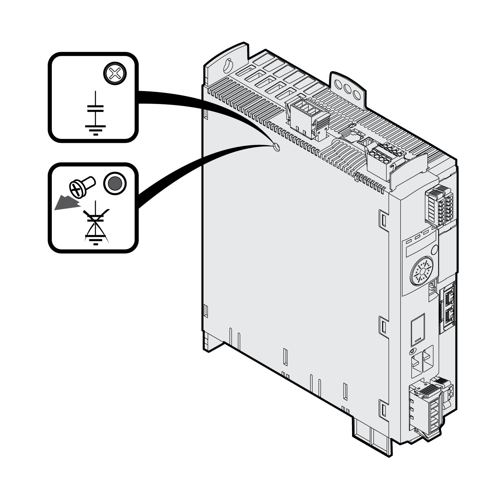

# Deactivating the Y Capacitors

## Description

The ground connections of the internal Y capacitors can be disconnected (deactivation). Usually, it is not required to deactivate the ground connection of the Y capacitors.

To deactivate the Y capacitors, remove the screw. Keep this screw so you can re-activate the Y capacitors, if required.

The drive no longer complies with the EMC limit values specified if the Y capacitors are deactivated.

0198441114060.03

© 2021

Schneider Electric.

All rights reserved.