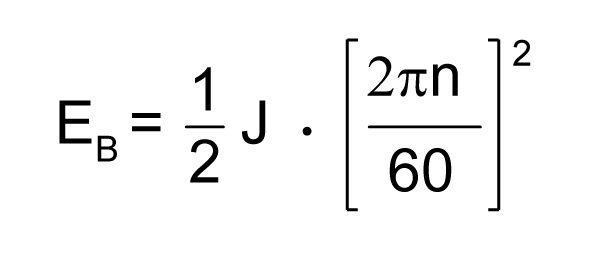
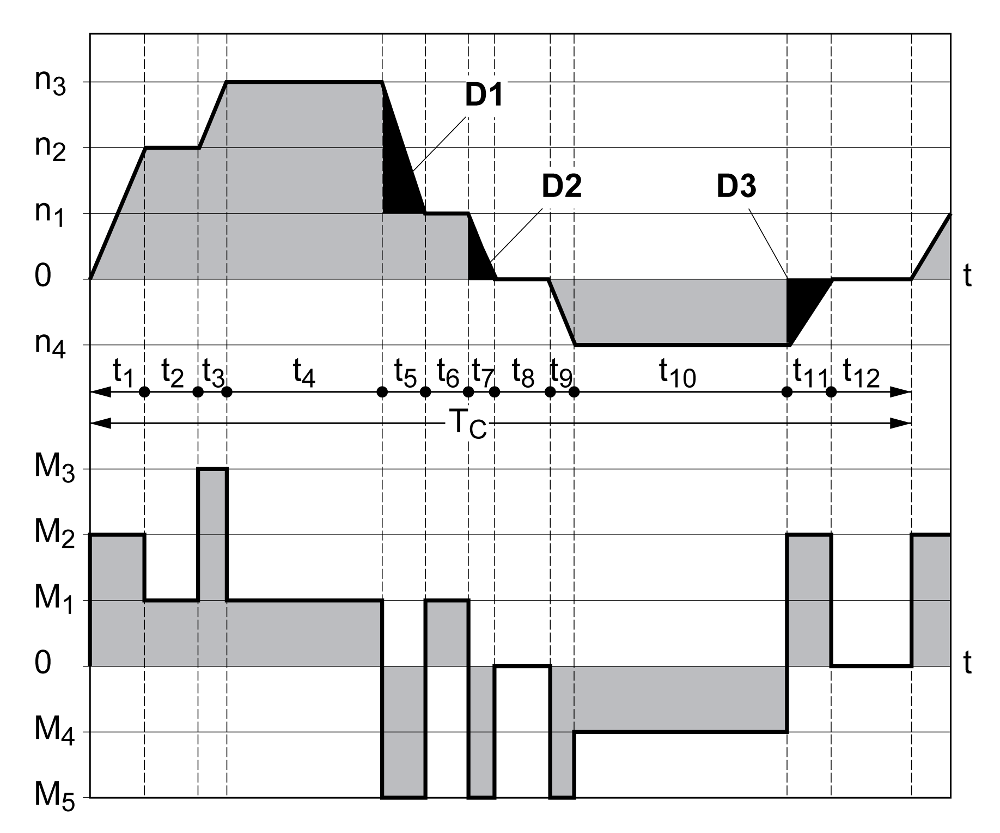
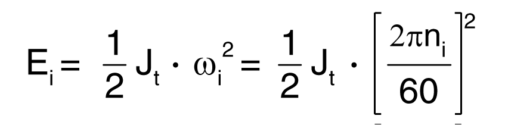
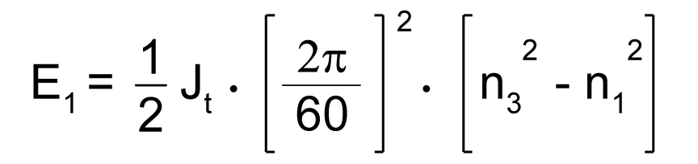
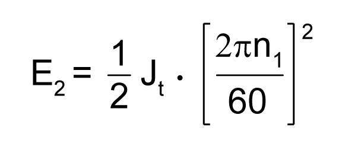
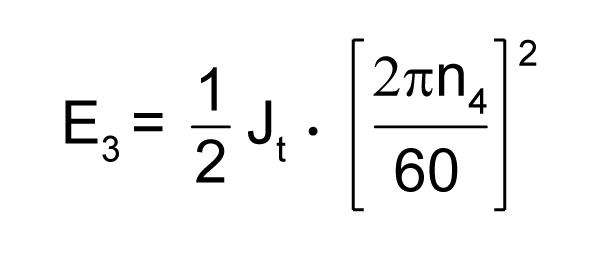
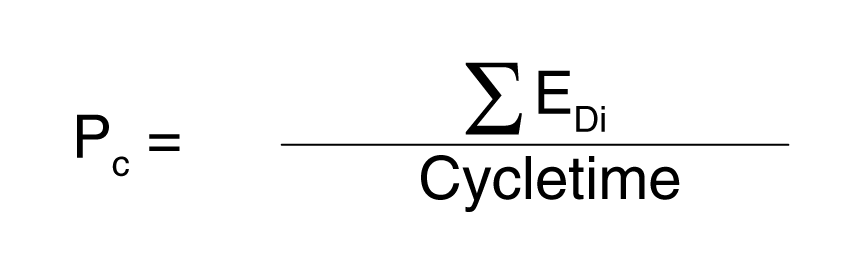

# Rating Information

## Description

To rate the braking resistor, calculate the proportion contributing to absorbing braking energy.

An external braking resistor is required if the kinetic energy that must be absorbed exceeds the possible total internal energy absorption.

## Internal Energy Absorption

Braking energy is absorbed internally by:

* DC bus capacitor Evar
* Internal braking resistor EI
* Electrical losses of the drive Eel
* Mechanical losses of the drive Emech

Values for the energy absorption Evar can be found in section [Capacitor and Braking Resistor](CapacitorAndBrakingResistor-CC4C94EE.html#CapacitorAndBrakingResistor-CC4C94EE).

## Internal Braking Resistor

Two characteristic values determine the energy absorption of the internal braking resistor.

* The continuous power PPR is the amount of energy that can be continuously absorbed without overloading the braking resistor.
* The maximum energy ECR limits the maximum short-term power that can be absorbed.

If the continuous power was exceeded for a specific time, the braking resistor must remain without load for a corresponding period.

The characteristic values PPR and ECR of the internal braking resistor can be found in section [Capacitor and Braking Resistor](CapacitorAndBrakingResistor-CC4C94EE.html#CapacitorAndBrakingResistor-CC4C94EE).

## Electrical Losses Eel

The electrical losses Eel of the drive system can be estimated on the basis of the peak power of the drive. The maximum power dissipation is approximately 10% of the peak power at a typical efficiency of 90%. If the current during deceleration is lower, the power dissipation is reduced accordingly.

## Mechanical Losses Emech

The mechanical losses result from friction during operation of the system. Mechanical losses are negligible if the time required by the system to coast to a stop without a driving force is considerably longer than the time required to decelerate the system. The mechanical losses can be calculated from the load torque and the velocity from which the motor is to stop.

## Example

Deceleration of a rotary motor with the following data:

* Initial speed of rotation: n = 4000 RPM
* Rotor inertia: JR = 4 kgcm2
* Load inertia: JL = 6 kgcm2
* Drive: Evar = 23 Ws, ECR = 80 Ws, PPR = 10 W

Calculation of the energy to be absorbed:

to EB = 88 Ws. Electrical and mechanical losses are ignored.

In this example, the DC bus capacitors absorb Evar = 23 Ws (the value depends on the drive type).

The internal braking resistor must absorb the remaining 65 Ws. It can absorb a pulse of ECR = 80 Ws. If the load is decelerated once, the internal braking resistor is sufficient.

If the deceleration is repeated cyclically, the continuous power must be taken into account. If the cycle time is longer than the ratio of the energy to be absorbed EB and the continuous power PPR, the internal braking resistor is sufficient. If the system decelerates more frequently, the internal braking resistor is not sufficient.

In this example, the ratio of EB/PPR is 8.8 s. An external braking resistor is required if the cycle time is shorter.

## Rating the External Braking Resistor

Characteristic curves for rating the braking resistor

These two characteristics are also used for the rating the motor. The segments of the characteristic curves to be considered are designated by Di (D1 ... D3).

The total inertia Jt must be known for the calculation of the energy at constant deceleration.

Jt = Jm + Jc

Jm: Motor inertia (with holding brake)

Jc: Load inertia

The energy for each deceleration segment is calculated as follows:

Calculation for the segments (D1) … (D3):

Units: Ei in Ws (wattseconds), Jt in kgm2, ω in rad and ni in RPM.

See the technical data for the energy absorption Evar of the drives (without consideration of a braking resistor).

In the next calculation steps, only consider those segments Di, whose energy Ei exceeds the energy absorption of the drive. These excess energies EDi must be diverted by means of the braking resistor.

EDi is calculated using the following formula:

EDi = Ei - Evar (in Ws)

The continuous power Pc is calculated for each machine cycle:

Units: Pc in W, EDi in Ws and cycle time T in s

The selection is made in two steps:

* If the following conditions are met, the internal braking resistor is sufficient.

  + The maximum energy during deceleration must be less than the peak energy that the braking resistor can absorb: (EDi)<(ECr).
  + The continuous power of the internal braking resistor must not be exceeded: (PC)<(PPr).
* If the conditions are not met, you must use an external braking resistor that meets the conditions.

For order data for the external braking resistors, see [Accessories and Spare Parts](AccessoriesAndSpareParts-C17F0DA3.html#AccessoriesAndSpareParts-C17F0DA3).

0198441114060.03

© 2021

Schneider Electric.

All rights reserved.