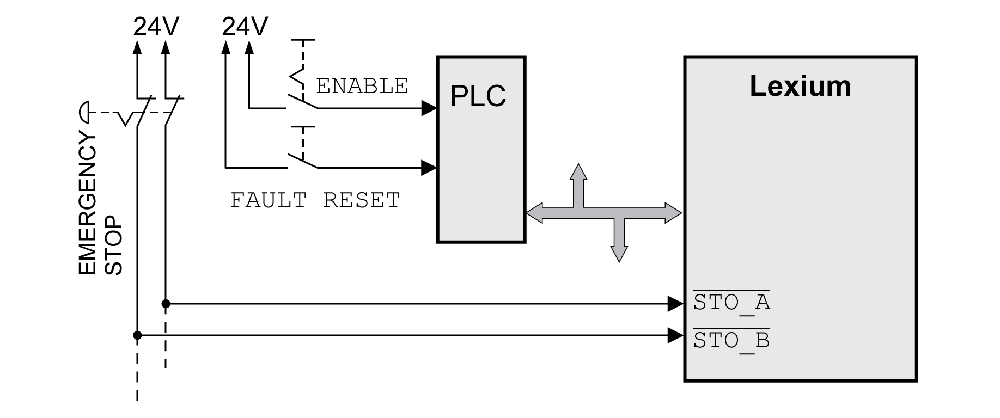
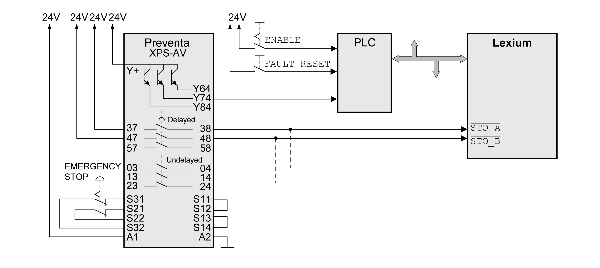

# Application Examples STO

## Example of Category 0 stop

Use without EMERGENCY STOP safety relay module, category 0 stop.

Example of category 0 stop:

In this example, when an EMERGENCY STOP is activated, it leads to a category 0 stop.

The safety-related function STO is triggered via a simultaneous 0-level at both inputs (time offset of less than 1 s). The power stage is disabled and an error of error class 3 is detected. The motor can no longer generate torque.

If the motor is not already at a standstill when the safety-related function STO is triggered, it decelerates under the salient physical forces (gravity, friction, etc.) active at the time until presumably coasting to a standstill.

If coasting of the motor and its potential load is unsatisfactory as determined by your risk assessment, an external safety-related brake may also be required.

| WARNING | |
| --- | --- |
|  | UNINTENDED EQUIPMENT OPERATION  Install a dedicated, external safety-related brake if coasting does not meet the deceleration requirements of your application.  Failure to follow these instructions can result in death, serious injury, or equipment damage. |

Refer to section [Holding Brake and Safety-Related Function STO](RequirementsForUsingTheSafety-Relat-BDEFF7FC.html#RequirementsForUsingTheSafety-Relat-BDEFF7FC__HoldingBrakeAndSafety-RelatedFuncti-BDEE51DD).

## Example of Category 1 stop

Use with EMERGENCY STOP safety relay module, category 1 stop.

Example of category 1 stop with external Preventa XPS-AV EMERGENCY STOP safety relay module:

In this example, when an EMERGENCY STOP is activated, it leads to a category 1 stop.

The EMERGENCY STOP safety relay module requests an immediate stop (undelayed) of the drive. After the time delay set in the EMERGENCY STOP safety relay module has elapsed, the EMERGENCY STOP safety relay triggers the safety-related function STO.

The safety-related function STO is triggered via a simultaneous 0-level at both inputs (time offset of less than 1 s). The power stage is disabled and an error of error class 3 is detected. The motor can no longer generate torque.

If coasting of the motor and its potential load is unsatisfactory as determined by your risk assessment, an external safety-related brake may also be required.

| WARNING | |
| --- | --- |
|  | UNINTENDED EQUIPMENT OPERATION  Install a dedicated, external safety-related brake if coasting does not meet the deceleration requirements of your application.  Failure to follow these instructions can result in death, serious injury, or equipment damage. |

Refer to section [Holding Brake and Safety-Related Function STO](RequirementsForUsingTheSafety-Relat-BDEFF7FC.html#RequirementsForUsingTheSafety-Relat-BDEFF7FC__HoldingBrakeAndSafety-RelatedFuncti-BDEE51DD).

0198441114060.03

© 2021

Schneider Electric.

All rights reserved.