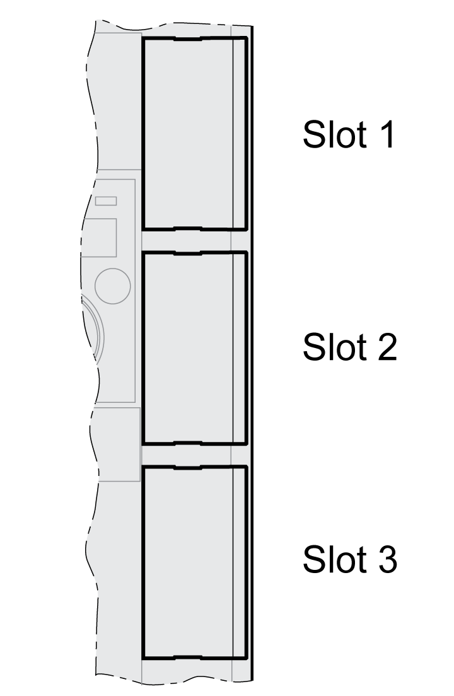
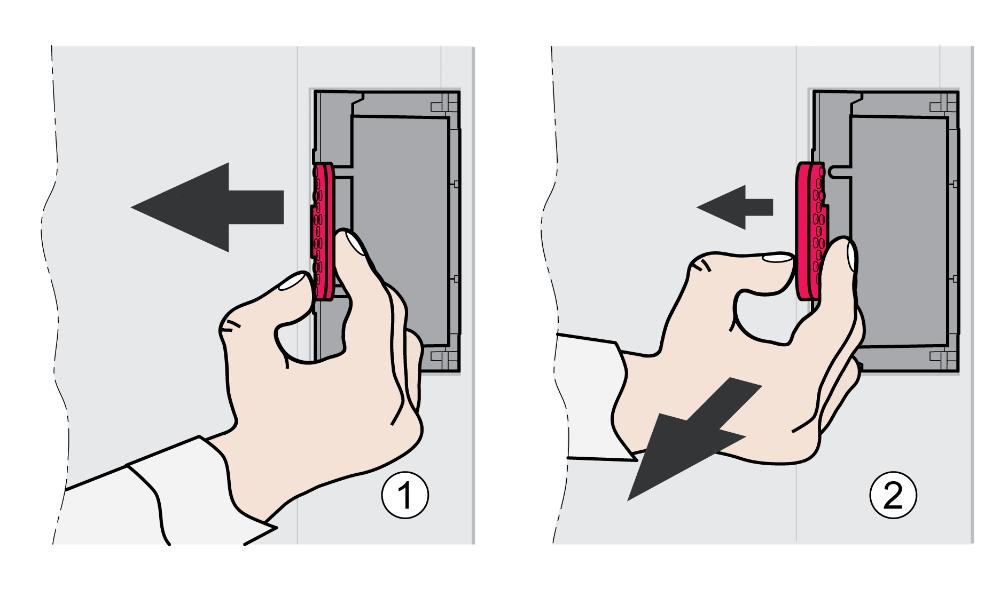

# Installing and Removing Modules

## Overview

Many components of the equipment, including the printed circuit board, operate with mains voltage, or present transformed high currents, and/or high voltages.

The motor itself generates voltage when the motor shaft is rotated.

| DANGER | |
| --- | --- |
|  | ELECTRIC SHOCK, EXPLOSION, OR ARC FLASH  * Disconnect all power from all equipment including connected devices prior to removing any covers or doors, or installing or removing any accessories, hardware, cables, or wires. * Place a "Do Not Turn On" or equivalent hazard label on all power switches and lock them in the non-energized position. * Wait 15 minutes to allow the residual energy of the DC bus capacitors to discharge. * Measure the voltage on the DC bus with a properly rated voltage sensing device and verify that the voltage is less than 42 Vdc. * Do not assume that the DC bus is voltage-free when the DC bus LED is off. * Block the motor shaft to prevent rotation prior to performing any type of work on the drive system. * Do not create a short-circuit across the DC bus terminals or the DC bus capacitors. * Replace and secure all covers, accessories, hardware, cables, and wires and confirm that a proper ground connection exists before applying power to the unit. * Use only the specified voltage when operating this equipment and any associated products.  Failure to follow these instructions will result in death or serious injury. |

Electrostatic discharge (ESD) may permanently damage the module either immediately or over time.

| NOTICE | |
| --- | --- |
|  | EQUIPMENT DAMAGE DUE TO ESD  * Use suitable ESD measures (for example, ESD gloves) when handling the module. * Do not touch internal components.  Failure to follow these instructions can result in equipment damage. |

The drive has 3 module slots:

The module slots are designed for the following modules:

| Slot | Module |
| --- | --- |
| Slot 1 | Safety module eSM |
| Slot 2 | Encoder module RSR (resolver interface)  Encoder module DIG (digital interface)  Encoder module ANA (analog interface) |
| Slot 3 | Fieldbus module Sercos III |

## Inserting a Module Into a Slot

Disconnect all power (power stage supply and 24 Vdc control supply) before inserting or removing a module.

Procedure for inserting a module:

| Step | Action |
| --- | --- |
| 1 | Fully read and understand the drive user guide as well as the user guide for the module prior to installing the module. |
| 2 | Verify that the order number on the nameplate of the module corresponds to the specification in the manual for the module. |
| 3 | Note and record the serial number, revision and DOM shown on the nameplate of the module and the nameplate of the device. |
| 4 | Remove the cover from the module slot and keep the cover. |
| 5 | Inspect the module for visible damage. Do not install damaged modules. |
| 6 | Push the module into the appropriate slot until the snap-in lock snaps in. |

Information on wiring can be found in the section "Installation" of the user guide for the module.

Fasten the connection cable to the cable guide of the device.

Various settings must be made the next time the drive is powered on. See the section "Commissioning" of the user guide for the module for details on these settings.

## Removing a Module From a Slot

Disconnect all power (power stage supply and 24 Vdc control supply) before inserting or removing a module.

Procedure for removing a module from a slot of the device:

* Label the connection cables. Remove the wiring of the module.
* Push the snap-in lock of the module to the left (1) and pull out the module at the snap-in lock (2) while holding it to the left.
* Close the module slot with the cover.

The next time the drive is powered on, it will signal a module replacement. See section [Acknowledging a Module Replacement](AcknowledgingAModuleReplacement-CE4EEE2A.html#AcknowledgingAModuleReplacement-CE4EEE2A) for additional information.

0198441114060.03

© 2021

Schneider Electric.

All rights reserved.