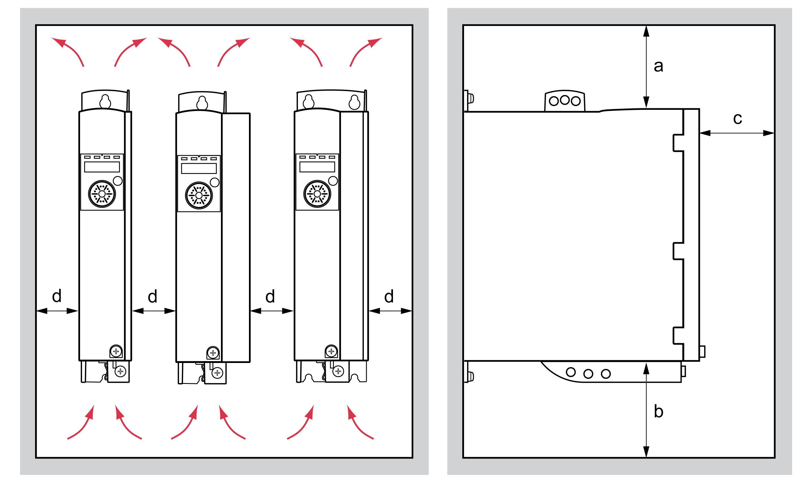

# Mounting the Drive

## Attaching a Hazard Label with Safety Instructions

Included in the packaging of the drive are adhesive hazard labels in German, French, Italian, Spanish and Chinese. The English version is affixed to the front of the drive by the factory. If the country to which your final machine or process is to be delivered is other than English speaking:

* Select the label suitable for the target country.

  Observe the safety regulations in the target country.
* Attach the label to the front of the drive so that it is clearly visible.

## Control Cabinet

The control cabinet (enclosure) must have a sufficient size so that all devices and components can be permanently installed and wired in compliance with the EMC requirements.

The ventilation of the control cabinet must be sufficient to comply with the specified ambient conditions for the devices and components operated in the control cabinet.

Install and operate this equipment in a control cabinet rated for its intended environment and secured by a keyed or tooled locking mechanism.

## Mounting Distances, Ventilation

When selecting the position of the device in the control cabinet, note the following:

* Mount the device in a vertical position (±10°). This is required for cooling the device.
* Adhere to the minimum installation distances for required cooling. Avoid heat accumulations.
* Do not mount the device close to heat sources.
* Do not mount the device on or near flammable materials.
* The heated airflow from other devices and components must not heat up the air used for cooling the device.
* If the thermal limits are exceeded during operation, the power stage of the drive is disabled (overtemperature).

The connection cables of the devices are routed to the top and to the bottom. The minimum distances must be adhered to for air circulation and cable installation.

Mounting distances and air circulation

|  |  |  |
| --- | --- | --- |
| Free space a | mm  (in) | ≥100  (≥3.94) |
| Free space b | mm  (in) | ≥100  (≥3.94) |
| Free space c | mm  (in) | ≥60  (≥2.36) |
| Free space d | mm  (in) | ≥0  (≥0) |

## Mounting the Device

See section [Dimensions](Dimensions-C7B5E917.html#Dimensions-C7B5E917) for the dimensions of the mounting holes.

Painted surfaces may create electrical resistance or isolation. Before mounting the device to a painted mounting plate, remove all paint across a large area of the mounting points.

0198441114060.03

© 2021

Schneider Electric.

All rights reserved.