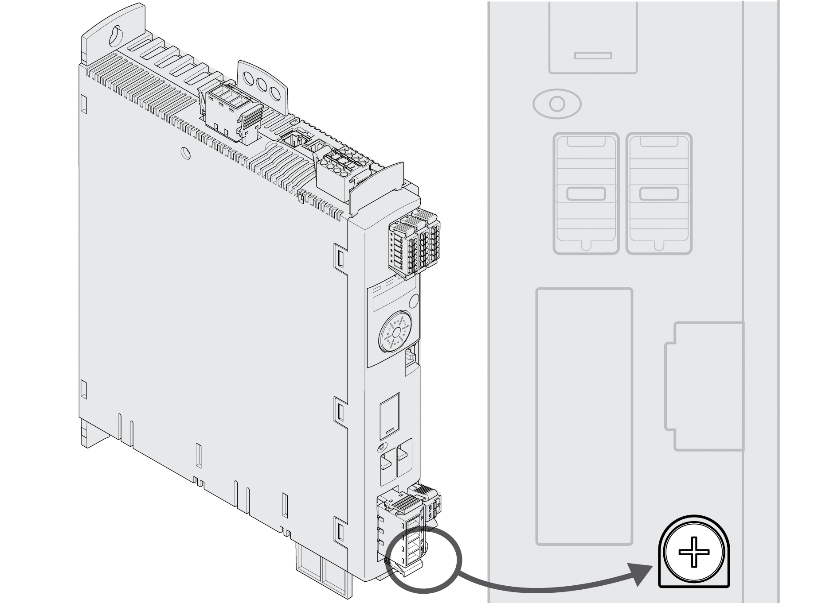

# Connection Grounding Screw

## Description

This product has a leakage current greater than 3.5 mA. If the protective ground connection is interrupted, a hazardous touch current may flow if the housing is touched.

| DANGER | |
| --- | --- |
|  | INSUFFICIENT GROUNDING  * Use a protective ground conductor with at least 10 mm2 (AWG 6) or two protective ground conductors with the cross section of the conductors supplying the power terminals. * Verify compliance with all local and national electrical code requirements as well as all other applicable regulations with respect to grounding of all equipment. * Ground the drive system before applying voltage. * Do not use conduits as protective ground conductors; use a protective ground conductor inside the conduit. * Do not use cable shields as protective ground conductors.  Failure to follow these instructions will result in death or serious injury. |

The central grounding screw of the product is located at the bottom of the front side.

Connect the ground connection of the device to the central grounding point of the system.

| Characteristic | Unit | Value |
| --- | --- | --- |
| Tightening torque of grounding screw | Nm  (lb.in) | 3.5  (31) |

0198441114060.03

© 2021

Schneider Electric.

All rights reserved.