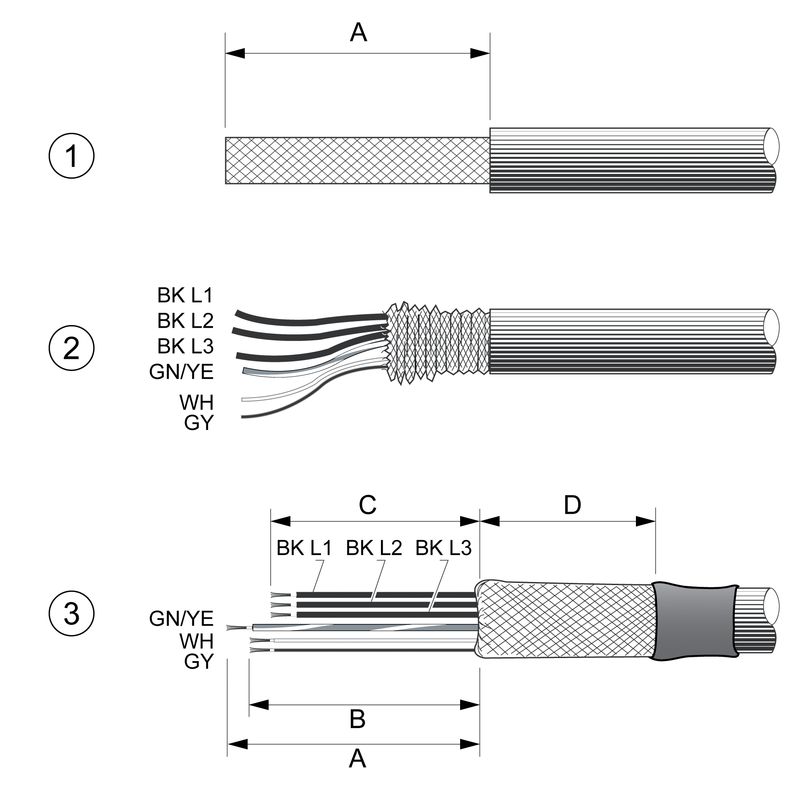
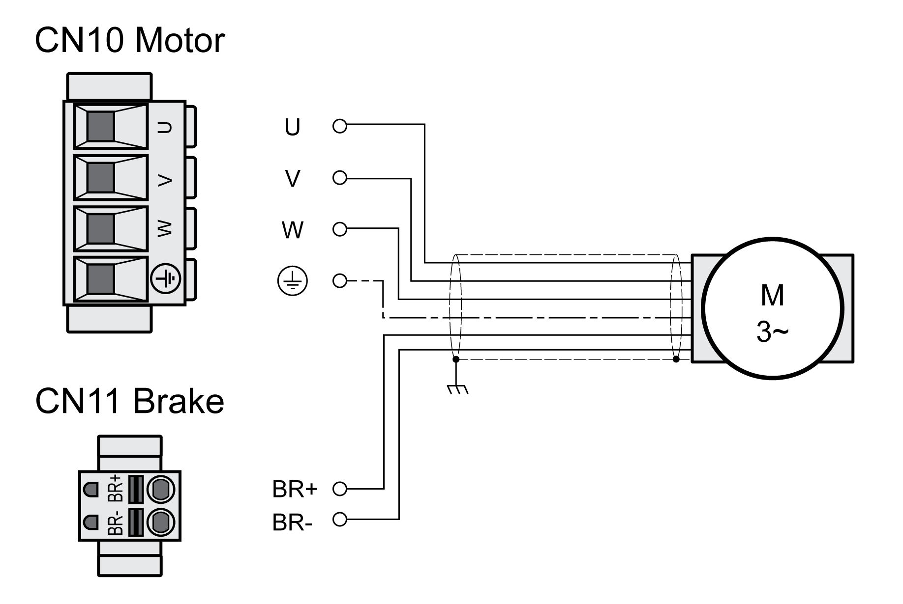
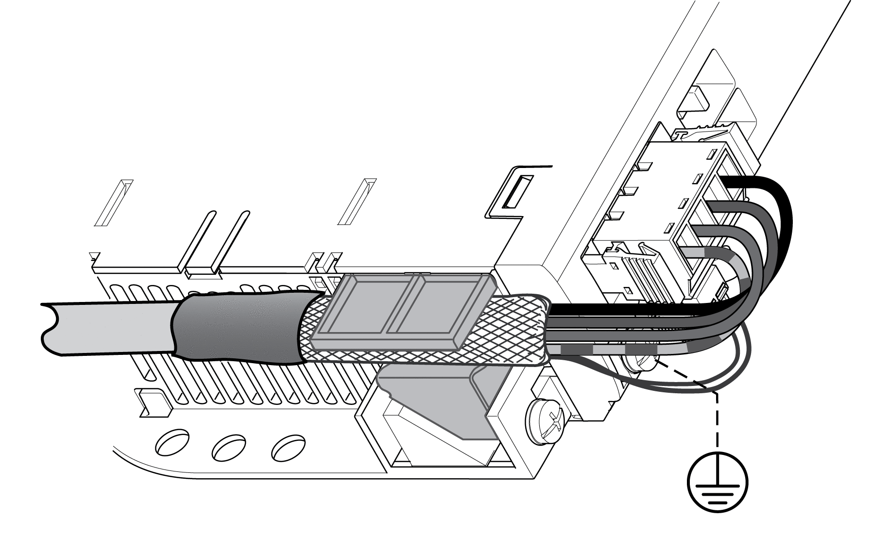

# Connection Motor Phases and Holding Brake (CN10 and CN11)

## General

The motor is designed for operation via a drive. Connecting the motor directly to AC voltage will damage the motor and can cause fires and initiate an explosion.

| DANGER | |
| --- | --- |
|  | POTENTIAL FOR EXPLOSION  Only connect the motor to a matching, approved drive in the way described in the present documentation.  Failure to follow these instructions will result in death or serious injury. |

High voltages may be present at the motor connection. The motor itself generates voltage when the motor shaft is rotated. AC voltage can couple voltage to unused conductors in the motor cable.

| DANGER | |
| --- | --- |
|  | ELECTRIC SHOCK  * Verify that no voltage is present prior to performing any type of work on the drive system. * Block the motor shaft to prevent rotation prior to performing any type of work on the drive system. * Insulate both ends of unused conductors of the motor cable. * Supplement the motor cable grounding conductor with an additional protective ground conductor to the motor housing if the protective ground conductor of the motor cable is insufficient. * Only touch the motor shaft or the mounted output components if all power has been disconnected. * Verify compliance with all local and national electrical code requirements as well as all other applicable regulations with respect to grounding of all equipment.  Failure to follow these instructions will result in death or serious injury. |

If third-party motors are used, insufficient isolation may allow hazardous voltages to enter the PELV circuit.

| DANGER | |
| --- | --- |
|  | ELECTRIC SHOCK CAUSED BY INSUFFICIENT ISOLATION  * Verify protective separation between the temperature sensor and the motor phases. * Verify that the signals at the encoder connection meet the PELV requirements. * Verify protective separation between the brake voltage in the motor and the motor cable, and the motor phases.  Failure to follow these instructions will result in death or serious injury. |

Drive systems may perform unintended movements if unapproved combinations of drive and motor are used. Though the connectors for motor connection and encoder connection may match mechanically, this does not imply that the motor is approved for use.

| WARNING | |
| --- | --- |
|  | UNINTENDED MOVEMENT  Only use approved combinations of drive and motor.  Failure to follow these instructions can result in death, serious injury, or equipment damage. |

See section [Approved Motors](PowerStageData-General-CC385EA8.html#PowerStageData-General-CC385EA8__ApprovedMotors-CC353C6A) for additional information.

When using pre-assembled cables, route the cables from the motor to the drive starting from the motor. Due to the pre-assembled connectors on the motor side, this direction is often faster and easier.

## Cable Specifications

|  |  |
| --- | --- |
| Shield: | Required, both ends grounded |
| Twisted Pair: | - |
| PELV: | The wires for the holding brake are PELV-compliant. |
| Cable composition: | 3 wires for motor phases  2 wires for holding brake  1 wire for protective ground (PE) |
| Maximum cable length: | Depends on the required limit values for conducted interference, see [Electromagnetic Emission](ElectromagneticEmission-BA38D58A.html#ElectromagneticEmission-BA38D58A). |

Note the following information:

* You may only connect the Schneider Electric original motor cable either pre-assembled or open wire.
* The wires for the holding brake must also be connected to the drive at connection CN11 in the case of motors without holding brakes. At the motor end, connect the wires to the appropriate pins for the holding brake; the cable can then be used for motors with or without holding brake. If you do not connect the wires at the motor end, you must isolate each wire individually (inductive voltages).
* Observe the polarity of the holding brake voltage.
* The voltage for the holding brake depends on the 24 Vdc control supply (PELV). Observe the tolerance for the 24 Vdc control supply and the specified voltage for the holding brake, see [24 Vdc Control Supply](VdcControlSupply-CC40A6EA.html#VdcControlSupply-CC40A6EA).

* Use pre-assembled cables to reduce the risk of wiring errors, see [Accessories and Spare Parts](AccessoriesAndSpareParts-C17F0DA3.html#AccessoriesAndSpareParts-C17F0DA3).

The optional holding brake of a motor is connected to connection CN11. The integrated holding brake controller releases the holding brake when the power stage is enabled. When the power stage is disabled, the holding brake is re-applied.

## Properties of the Connection Terminals CN10

The terminals are approved for stranded conductors and solid conductors. Use wire cable ends (ferrules), if possible.

| Characteristic | Unit | Value | |
| --- | --- | --- | --- |
| LXM32•U45, LXM32•U60, LXM32•U90, LXM32•D12, LXM32•D18, LXM32•D30 | LXM32•D72 |
| Connection cross section | mm2  (AWG) | 0.75 ... 5.3  (18 ... 10) | 0.75 ... 10  (18 ... 8) |
| Tightening torque for terminal screws | Nm  (lb.in) | 0.68  (6.0) | 1.81  (16.0) |
| Stripping length | mm  (in) | 6 ... 7  (0.24 ... 0.28) | 8 ... 9  (0.31 ... 0.35) |

## Properties of the Connection Terminals CN11

The terminals are approved for stranded conductors and solid conductors. Use wire cable ends (ferrules), if possible.

| Characteristic | Unit | Value |
| --- | --- | --- |
| Maximum terminal current | A | 1.7 |
| Connection cross section | mm2  (AWG) | 0.75 ... 2.5  (18 ... 14) |
| Stripping length | mm  (in) | 12 ... 13  (0.47 ... 0.51) |

## Assembling Cables

Note the dimensions specified when assembling cables.

Steps for assembling the motor cable

**1** Strip the cable jacket, length A.

**2** Slide the shielding braid back over the cable jacket.

**3** Secure the shielding braid with a heat shrink tube. The shield must have at least length D. Verify that a large surface area of the shielding braid is connected to the EMC shield clamp. Shorten the wires for the holding brake to length B and the three wires for the motor phases to length C. The protective ground conductor has length A. Connect the wires for the holding brake to the drive even in the case of motors without a holding brake (inductive voltage).

| Characteristic | Unit | Value |
| --- | --- | --- |
| A | mm (in) | 140 (5.51) |
| B | mm (in) | 135 (5.32) |
| C | mm (in) | 130 (5.12) |
| D | mm (in) | 50 (1.97) |

Observe the maximum permissible connection cross section. Take into account the fact that wire cable ends (ferrules) increase the cross section size.

## Monitoring

The drive monitors the motor phases for:

* Short-circuit between the motor phases
* Short-circuit between the motor phases and ground

Short-circuits between the motor phases and the DC bus, the braking resistor or the holding brake wires are not detected.

## Wiring Diagram Motor and Holding Brake

Wiring diagram motor with holding brake

| Connection | Meaning | Color |
| --- | --- | --- |
| U | Motor phase | Black L1 (BK) |
| V | Motor phase | Black L2 (BK) |
| W | Motor phase | Black L3 (BK) |
| PE | Protective ground conductor | Green/yellow (GN/YE) |
| BR+ | Holding brake + | White (WH) or black 5 (BK) |
| BR- | Holding brake - | Gray (GR) or black 6 (BK) |

## Connecting the Motor Cable

* Connect the motor phases and protective ground conductor to CN10. Verify that the connections U, V, W and PE (ground) match at the motor and the drive.
* Note the tightening torque specified for the terminal screws.
* Connect the white wire or the black wire with the label 5 to connection BR+ of CN11.

  Connect the gray wire or the black wire with the label 6 to connection BR- of CN11.
* Verify that the connector locks snap in properly.
* Connect the cable shield to the shield clamp (large surface area contact).

Shield clamp motor cable

0198441114060.03

© 2021

Schneider Electric.

All rights reserved.