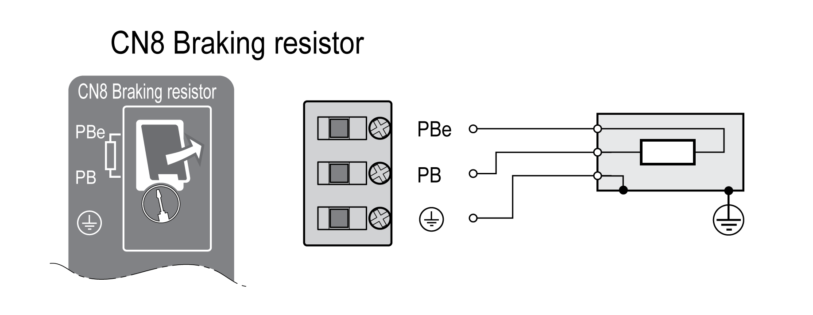
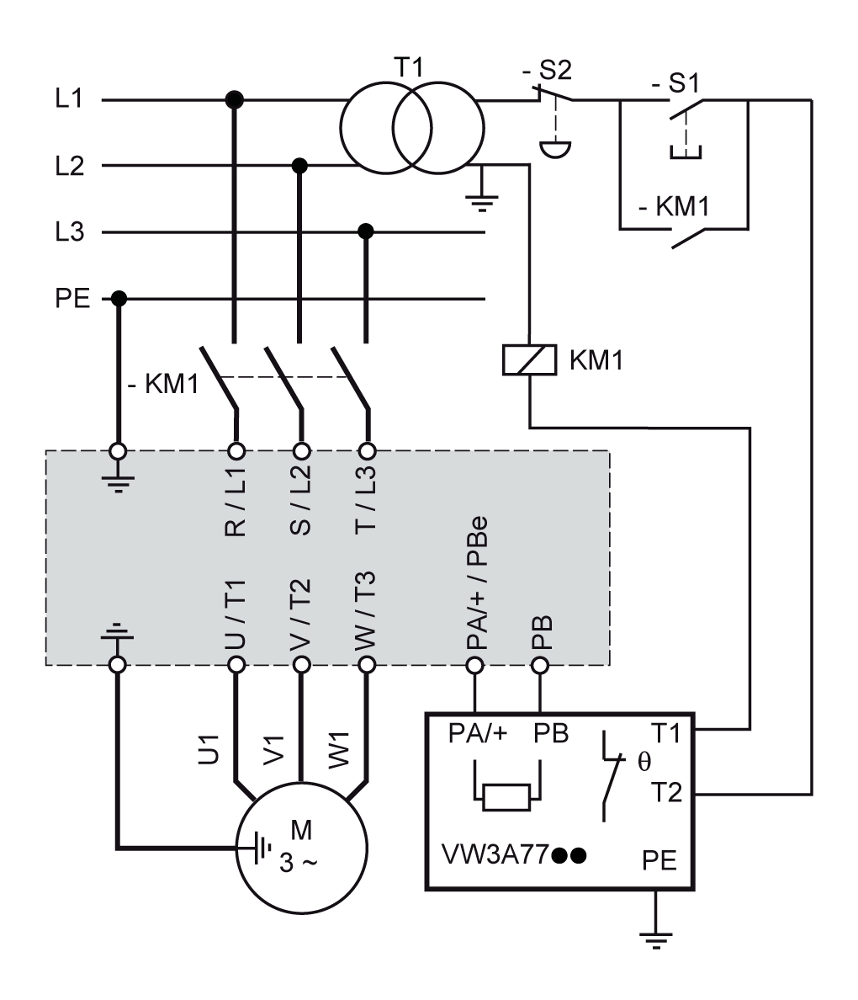

# Connection Braking Resistor (CN8, Braking Resistor)

## General

An insufficiently rated braking resistor can cause overvoltage on the DC bus. Overvoltage on the DC bus causes the power stage to be disabled. The motor is no longer actively decelerated.

| WARNING | |
| --- | --- |
|  | UNINTENDED EQUIPMENT OPERATION  * Verify that the braking resistor has a sufficient rating by performing a test run under maximum load conditions. * Verify that the parameter settings for the braking resistor are correct.  Failure to follow these instructions can result in death, serious injury, or equipment damage. |

## Internal Braking Resistor

A braking resistor is integrated in the drive to absorb braking energy. The drive is shipped with the internal braking resistor active.

## External Braking Resistor

An external braking resistor is required for applications in which the motor must be decelerated quickly and the internal braking resistor cannot absorb the excess braking energy.

Selection and rating of the external braking resistor are described in section [Rating the Braking Resistor](RatingTheBrakingResistor-CDCB1040.html#RatingTheBrakingResistor-CDCB1040). For suitable braking resistors, see [Accessories and Spare Parts](AccessoriesAndSpareParts-C17F0DA3.html#AccessoriesAndSpareParts-C17F0DA3).

## Cable Specifications

|  |  |
| --- | --- |
| Shield: | Required, both ends grounded |
| Twisted Pair: | - |
| PELV: | - |
| Cable composition: | Minimum conductor cross section: Same cross section as power stage supply, see [Connection Power Stage Supply (CN1)](ConnectionPowerStageSupplyCN1-C07BA349.html#ConnectionPowerStageSupplyCN1-C07BA349).  The conductors must have a sufficiently large cross section so that the fuse at the mains connection can protect the equipment if necessary. |
| Maximum cable length: | 3 m (9.84 ft) |

## Properties of the Connection Terminals CN8

| Characteristic | Unit | Value |
| --- | --- | --- |
| Connection cross section | mm2  (AWG) | 0.75 ... 3.3  (18 ... 12) |
| Tightening torque for terminal screws | Nm  (lb.in) | 0.51  (4.5) |
| Stripping length | mm  (in) | 10 ... 11  (0.39 ... 0.43) |

The terminals are approved for fine-stranded conductors and solid conductors. Observe the maximum permissible connection cross section. Take into account the fact that wire cable ends (ferrules) increase the cross section size.

If you use wire cable ends (ferrules), use only wire cable ends (ferrules) with collars for these terminals.

## Wiring Diagram

## Connecting the External Braking Resistor

* Power off all supply voltages. Observe the safety instructions concerning electrical installation, see [Product Related Information](AboutTheBook-A6C3BFEC.html#AboutTheBook-A6C3BFEC__ProductRelatedInformation-A6C3FD71).
* Verify that no voltages are present (safety instructions).
* Remove the cover from the connection.
* Ground the ground connection (PE) of the braking resistor.
* Connect the external braking resistor to the drive. Note the tightening torque specified for the terminal screws.
* Connect the cable shield to the shield connection at the bottom of the drive (large surface area contact).

The parameter RESint\_ext is used to switch between the internal and an external braking resistor. See section [Setting the Braking Resistor Parameters](SettingTheBrakingResistorParameters-C4244ABD.html#SettingTheBrakingResistorParameters-C4244ABD) for the parameter settings for the braking resistor. Verify correct operation of the braking resistor during commissioning.

## Wiring Example

The following graphic shows a functional principle:

0198441114060.03

© 2021

Schneider Electric.

All rights reserved.