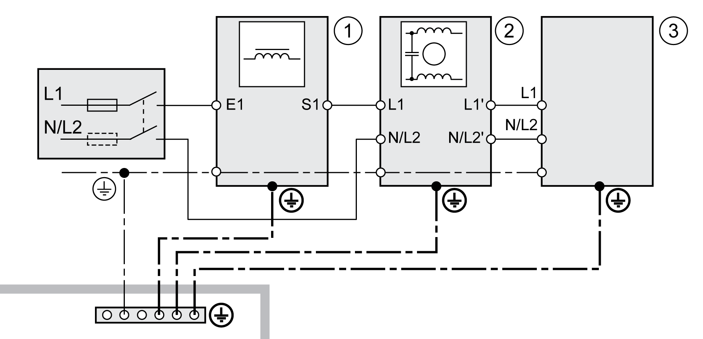
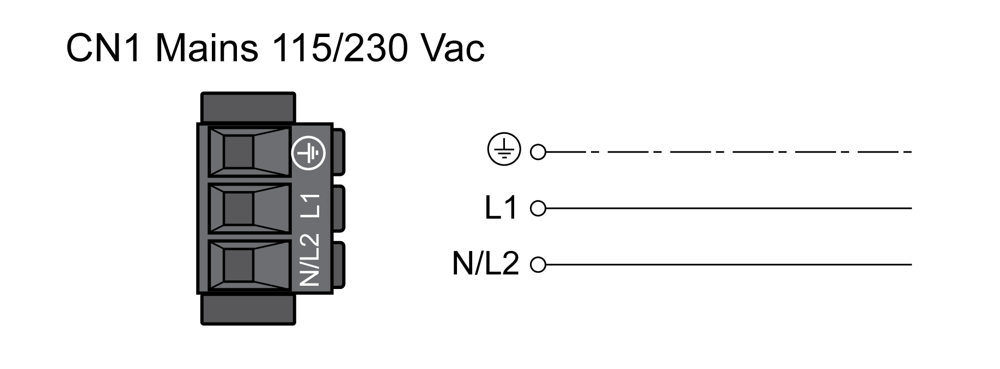
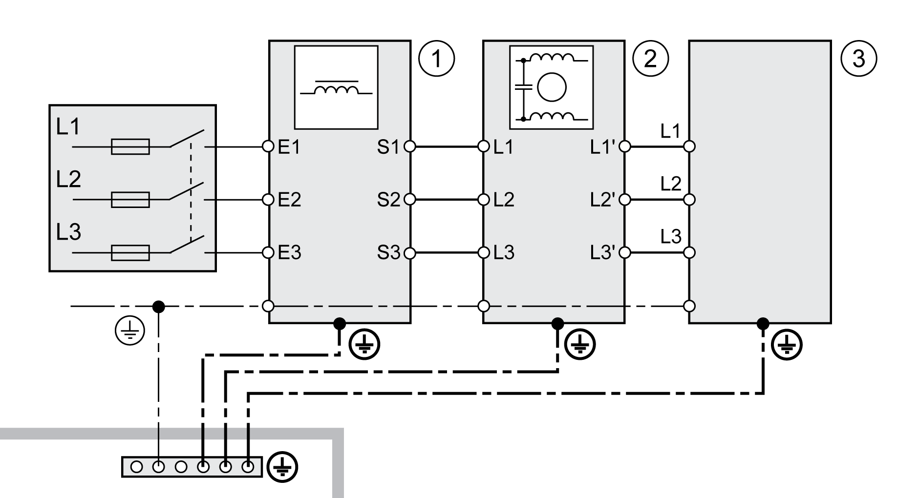
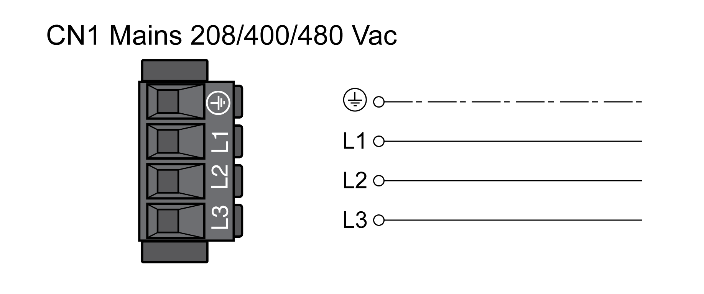

# Connection Power Stage Supply (CN1)

## General

This product has a leakage current greater than 3.5 mA. If the protective ground connection is interrupted, a hazardous touch current may flow if the housing is touched.

| DANGER | |
| --- | --- |
|  | INSUFFICIENT GROUNDING  * Use a protective ground conductor with at least 10 mm2 (AWG 6) or two protective ground conductors with the cross section of the conductors supplying the power terminals. * Verify compliance with all local and national electrical code requirements as well as all other applicable regulations with respect to grounding of all equipment. * Ground the drive system before applying voltage. * Do not use conduits as protective ground conductors; use a protective ground conductor inside the conduit. * Do not use cable shields as protective ground conductors.  Failure to follow these instructions will result in death or serious injury. |

| WARNING | |
| --- | --- |
|  | INSUFFICIENT PROTECTION AGAINST OVERCURRENT  * Use the external fuses specified in section "Technical data". * Do not connect the product to a supply mains whose short-circuit current rating (SCCR) exceeds the value specified in the section "Technical Data".  Failure to follow these instructions can result in death, serious injury, or equipment damage. |

| WARNING | |
| --- | --- |
|  | INCORRECT MAINS VOLTAGE  Verify that the product is approved for the mains voltage before applying power and configuring the product.  Failure to follow these instructions can result in death, serious injury, or equipment damage. |

The products are intended for industrial use and may only be operated with a permanently installed connection.

Prior to connecting the drive, verify the approved mains types, see [Power Stage Data - General](PowerStageData-General-CC385EA8.html#PowerStageData-General-CC385EA8).

## Cable Specifications

|  |  |
| --- | --- |
| Shield: | - |
| Twisted Pair: | - |
| PELV: | - |
| Cable composition: | The conductors must have a sufficiently large cross section so that the fuse at the mains connection can protect the equipment if necessary. |
| Maximum cable length: | - |

## Properties of Connection Terminals CN1

| Characteristic | Unit | Value | |
| --- | --- | --- | --- |
| LXM32•U45, LXM32•U60, LXM32•U90, LXM32•D12, LXM32•D18, LXM32•D30 | LXM32•D72 |
| Connection cross section | mm2  (AWG) | 0.75 ... 5.3  (18 ... 10) | 0.75 ... 10  (18 ... 8) |
| Tightening torque for terminal screws | Nm  (lb.in) | 0.68  (6.0) | 1.81  (16.0) |
| Stripping length | mm  (in) | 6 ... 7  (0.24 ... 0.28) | 8 ... 9  (0.31 ... 0.35) |

The terminals are approved for stranded conductors and solid conductors. Use wire cable ends (ferrules), if possible.

## Prerequisites for Connecting the Power Stage Supply

Note the following information:

* Three-phase drives may only be connected and operated via three phases.
* Use upstream mains fuses.
* If you use an external mains filter, the mains cable must be shielded and grounded at both ends if the length between the external mains filter and the drive exceeds 200 mm (7.87 in).
* See section [Conditions for UL 508C and CSA](ConditionsForUL508CAndCSA-CC3763BD.html#ConditionsForUL508CAndCSA-CC3763BD) for a UL-compliant design.

## Power Stage Supply Single-Phase Drive

The illustration shows an overview for wiring the power stage supply for a single-phase drive. The illustration also shows an external mains filter and a mains reactor which are available as accessories.

Overview power stage supply for single-phase drive

**1** Mains reactor (accessory)

**2** External mains filter (accessory)

**3** Drive

Wiring diagram power stage supply for single-phase drive.

* Verify the type of mains. See section [Power Stage Data - General](PowerStageData-General-CC385EA8.html#PowerStageData-General-CC385EA8) for the approved types of mains.
* Connect the mains cable. Note the tightening torque specified for the terminal screws.
* Verify that the connector locks snap in properly.

## Power Stage Supply Three-Phase Drive

The illustration shows an overview for wiring the power stage supply for a three-phase drive. The illustration also shows an external mains filter and a mains reactor which are available as accessories.

Wiring diagram, power stage supply for three-phase drive.

**1** Mains reactor (accessory)

**2** External mains filter (accessory)

**3** Drive

Wiring diagram power stage supply for three-phase drive.

* Verify the type of mains. See section [Power Stage Data - General](PowerStageData-General-CC385EA8.html#PowerStageData-General-CC385EA8) for the approved types of mains.
* Connect the mains cable. Note the tightening torque specified for the terminal screws.
* Verify that the connector locks snap in properly.

0198441114060.03

© 2021

Schneider Electric.

All rights reserved.