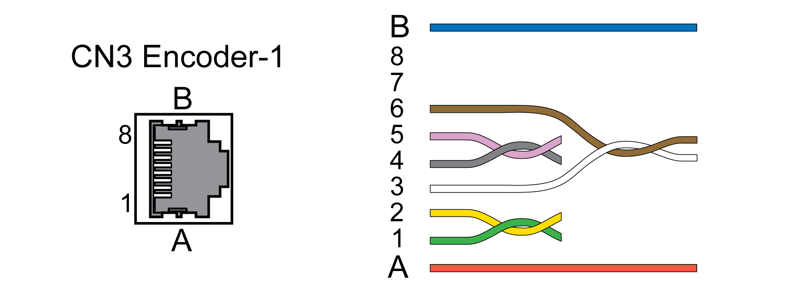

# Connection Motor Encoder (CN3)

## Function and Encoder Type

The motor encoder is a Hiperface encoder integrated in the motor. It provides the device with information on the motor position.

## Cable Specifications

|  |  |
| --- | --- |
| Shield: | Required, both ends grounded |
| Twisted Pair: | Required |
| PELV: | Required |
| Cable composition: | 6 \* 0.14 mm2 + 2 \* 0.34 mm2  (6 \* AWG 24 + 2 \* AWG 20) |
| Maximum cable length: | 100 m (328.08 ft) |

Use pre-assembled cables to reduce the risk of wiring errors, see [Accessories and Spare Parts](AccessoriesAndSpareParts-C17F0DA3.html#AccessoriesAndSpareParts-C17F0DA3).

## Wiring Diagram

| Pin | Signal | Motor, pin | Pair | Meaning | I/O |
| --- | --- | --- | --- | --- | --- |
| 1 | COS+ | 9 | 2 | Cosine signal | I |
| 2 | REFCOS | 5 | 2 | Reference for cosine signal | I |
| 3 | SIN+ | 8 | 3 | Sine signal | I |
| 6 | REFSIN | 4 | 3 | Reference for sine signal | I |
| 4 | Data | 6 | 1 | Receive data, transmit data | I/O |
| 5 | Data | 7 | 1 | Receive data and transmit data, inverted | I/O |
| 7 ... 8 | - |  | 4 | Reserved |  |
| A | ENC+10V\_OUT | 10 | 5 | Encoder supply | O |
| B | ENC\_0V | 11 | 5 | Reference potential for encoder supply |  |
|  | SHLD |  |  | Shield |  |

| WARNING | |
| --- | --- |
|  | UNINTENDED EQUIPMENT OPERATION  Do not connect any wiring to reserved, unused connections, or to connections designated as No Connection (N.C.).  Failure to follow these instructions can result in death, serious injury, or equipment damage. |

## Connecting the Motor Encoder

* Verify that wiring, cables and connected interfaces meet the PELV requirements.
* Connect the connector to CN3 Encoder-1.
* Verify that the connector locks snap in properly.

When using pre-assembled cables, route the cables from the motor to the drive starting from the motor. Due to the pre-assembled connectors on the motor side, this direction is often faster and easier.

0198441114060.03

© 2021

Schneider Electric.

All rights reserved.