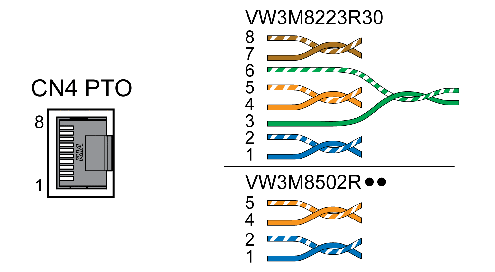

# Connection PTO (CN4, Pulse Train Out)

## General

5 V signals are available at the PTO (Pulse Train Out, CN4) output. Depending on parameter PTO\_mode, these signals are ESIM signals (encoder simulation) or logically fed through PTI input signals (P/D signals, A/B signals, CW/CCW signals). The PTO output signals can be used as PTI input signals for another drive. The signal level corresponds to RS422, see [Output PTO (CN4)](OutputPTOCN4-CC475A64.html#OutputPTOCN4-CC475A64). The PTO output supplies 5 V signals, even if the PTI input signal is a 24 V signal.

## Availability

Available with firmware version ≥V01.04.

## Cable Specifications

|  |  |
| --- | --- |
| Shield: | Required, both ends grounded |
| Twisted Pair: | Required |
| PELV: | Required |
| Cable composition: | 8 \* 0.14 mm2 (8 \* AWG 24) |
| Maximum cable length: | 100 m (328 ft) |

Use pre-assembled cables to reduce the risk of wiring errors, see [Accessories and Spare Parts](AccessoriesAndSpareParts-C17F0DA3.html#AccessoriesAndSpareParts-C17F0DA3).

## Wiring Diagram

Wiring diagram Pulse Train Out (PTO)

| Pin | Signal | Pair | Meaning |
| --- | --- | --- | --- |
| 1 | ESIM\_A | 2 | ESIM channel A |
| 2 | ESIM\_A | 2 | ESIM channel A, inverted |
| 4 | ESIM\_B | 1 | ESIM channel B |
| 5 | ESIM\_B | 1 | ESIM channel B, inverted |
| 3 | ESIM\_I | 3 | ESIM index pulse |
| 6 | ESIM\_I | 3 | ESIM index pulse, inverted |
| 7 | PTO\_0V | 4 | Reference potential |
| 8 | PTO\_0V | 4 | Reference potential |

## PTO: Logically Fed Through PTI Signals

At the PTO output, the PTI input signals can be made available again to control a subsequent drive (daisy chain). Depending on the input signal, the output signal can be of type P/D signal, A/B signal or CW/CCW signal. The PTO output supplies 5 V signals.

## Connecting PTO

* Connect the connector to CN4. Verify correct pin assignment.
* Verify that the connector locks snap in properly.

0198441114060.03

© 2021

Schneider Electric.

All rights reserved.