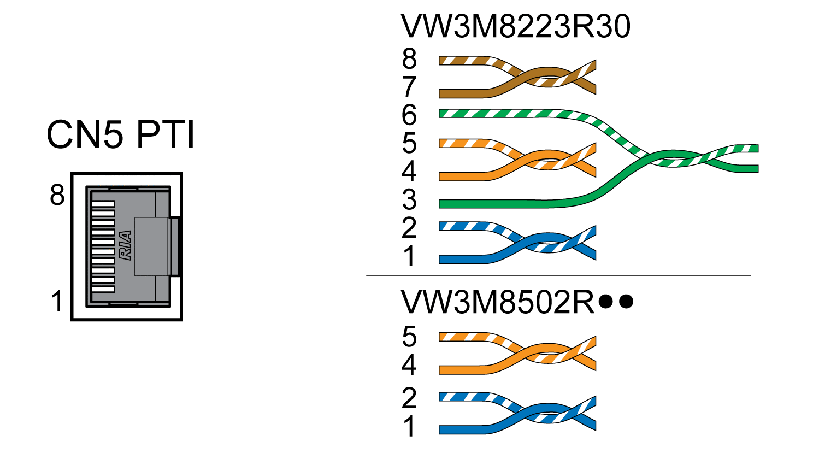
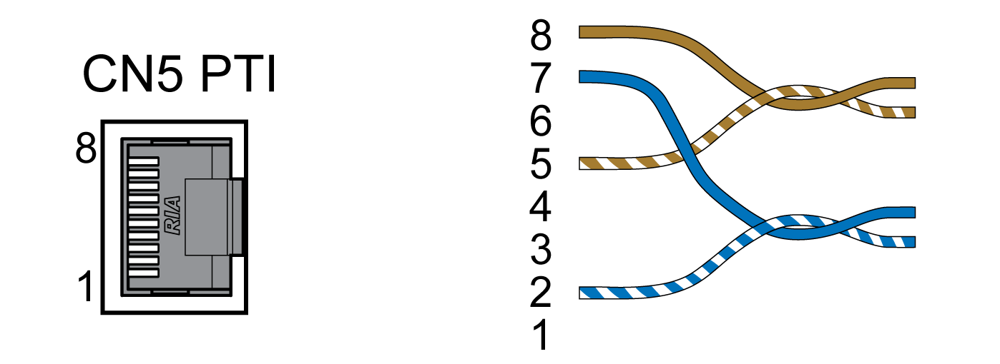

# Connection PTI (CN5, Pulse Train In)

## General

P/D (pulse/direction), A/B signals or CW/CCW signals can be connected to the PTI connection (Pulse Train In, CN5).

It is possible to connect 5 V signals or 24 V signals, see [Input PTI (CN5)](InputPTICN5-CC48225E.html#InputPTICN5-CC48225E). Pin assignments and cables are different.

Incorrect or interfered signals as reference values can cause unintended movements.

| WARNING | |
| --- | --- |
|  | UNINTENDED MOVEMENT  * Use shielded twisted-pair cables. * Do not use signals without push-pull in environments subject to interference. * Use signals with push-pull in the case of cable lengths of more than 3 m (9.84 ft) and limit the frequency to 50 kHz.  Failure to follow these instructions can result in death, serious injury, or equipment damage. |

## Availability

Available with firmware version ≥V01.04.

## Cable Specifications PTI

|  |  |
| --- | --- |
| Shield: | Required, both ends grounded |
| Twisted Pair: | Required |
| PELV: | Required |
| Minimum conductor cross section: | 0.14 mm2 (AWG 24) |
| Maximum cable length: | 100 m (328 ft) with RS422  10 m (32.8 ft) with push-pull  1 m (3.28 ft) with open collector |

Use pre-assembled cables to reduce the risk of wiring errors, see [Accessories and Spare Parts](AccessoriesAndSpareParts-C17F0DA3.html#AccessoriesAndSpareParts-C17F0DA3).

## Connection Assignment PTI 5 V

Wiring diagram Pulse Train In (PTI) 5 V

P/D signals 5 V

| Pin | Signal | Pair | Meaning |
| --- | --- | --- | --- |
| 1 | PULSE(5V) | 2 | Pulse 5V |
| 2 | PULSE | 2 | Pulse, inverted |
| 4 | DIR(5V) | 1 | Direction 5V |
| 5 | DIR | 1 | Direction, inverted |

A/B signals 5 V

| Pin | Signal | Pair | Meaning |
| --- | --- | --- | --- |
| 1 | ENC\_A(5V) | 2 | Encoder channel A 5V |
| 2 | ENC\_A | 2 | Encoder channel A, inverted |
| 4 | ENC\_B(5V) | 1 | Encoder channel B 5V |
| 5 | ENC\_B | 1 | Encoder channel B, inverted |

CW/CCW signals 5 V

| Pin | Signal | Pair | Meaning |
| --- | --- | --- | --- |
| 1 | CW(5V) | 2 | Pulse positive 5V |
| 2 | CW | 2 | Pulse positive, inverted |
| 4 | CCW(5V) | 1 | Pulse negative 5V |
| 5 | CCW | 1 | Pulse negative, inverted |

| WARNING | |
| --- | --- |
|  | UNINTENDED EQUIPMENT OPERATION  Do not connect any wiring to reserved, unused connections, or to connections designated as No Connection (N.C.).  Failure to follow these instructions can result in death, serious injury, or equipment damage. |

Connecting Pulse Train IN (PTI) 5 V

* Connect the connector to CN5. Verify correct pin assignment.
* Verify that the connector locks snap in properly.

## Connection Assignment PTI 24 V

Note that the wire pairs for 24 V signals require assignments different from those for 5 V signals. Use a cable that complies with the cable specification. Assemble the cable as shown in the illustration below.

Wiring diagram Pulse Train In (PTI) 24 V.

P/D signals 24 V

| Pin | Signal | Pair | Meaning |
| --- | --- | --- | --- |
| 7 | PULSE(24V) | A | Pulse 24V |
| 2 | PULSE | A | Pulse, inverted |
| 8 | DIR(24V) | B | Direction 24V |
| 5 | DIR | B | Direction, inverted |

A/B signals 24 V

| Pin | Signal | Pair | Meaning |
| --- | --- | --- | --- |
| 7 | ENC\_A(24V) | A | Encoder channel A 24V |
| 2 | ENC\_A | A | Encoder channel A, inverted |
| 8 | ENC\_B(24V) | B | Encoder channel B 24V |
| 5 | ENC\_B | B | Encoder channel B, inverted |

CW/CCW signals 24 V

| Pin | Signal | Pair | Meaning |
| --- | --- | --- | --- |
| 7 | CW(24V) | A | Pulse positive 24V |
| 2 | CW | A | Pulse positive, inverted |
| 8 | CCW(24V) | B | Pulse negative 24V |
| 5 | CCW | B | Pulse negative, inverted |

| WARNING | |
| --- | --- |
|  | UNINTENDED EQUIPMENT OPERATION  Do not connect any wiring to reserved, unused connections, or to connections designated as No Connection (N.C.).  Failure to follow these instructions can result in death, serious injury, or equipment damage. |

Connecting Pulse Train In (PTI) 24 V

* Connect the connector to CN5. Verify correct pin assignment.
* Verify that the connector locks snap in properly.

0198441114060.03

© 2021

Schneider Electric.

All rights reserved.