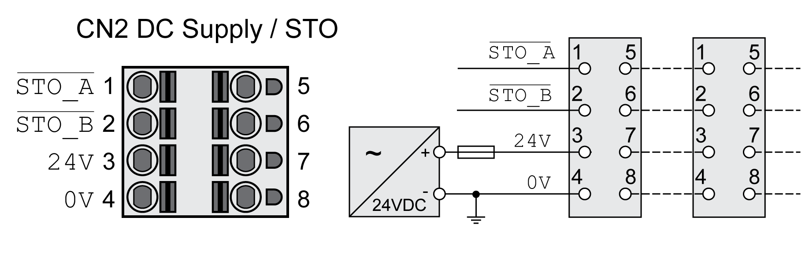

# Connection 24 Vdc Control Supply and STO (CN2, DC Supply and STO)

## General

The 24 Vdc supply voltage is connected with many exposed signal connections in the drive system.

| WARNING | |
| --- | --- |
|  | UNINTENDED EQUIPMENT OPERATION  * Use power supply units that meet the PELV (Protective Extra Low Voltage) requirements. * Connect the 0 Vdc outputs of all power supply units to FE (functional earth/functional ground), for example, for the VDC supply voltage and for the 24 Vdc voltage for the safety-related function STO. * Interconnect all 0 Vdc outputs (reference potentials) of all power supply units used for the drive.  Failure to follow these instructions can result in death, serious injury, or equipment damage. |

The connection for the 24 Vdc control supply at the product does not have an inrush current limitation. If the voltage is applied by means of switching of contacts, damage to the contacts or contact welding may result.

| NOTICE | |
| --- | --- |
|  | PERMANENT DAMAGE TO CONTACTS  * Switch the power input (primary side) of the power supply unit. * Do not switch the output voltage (secondary side) of the power supply unit.  Failure to follow these instructions can result in equipment damage. |

## Safety Function STO

Information on the signals of the safety function STO can be found in section [Functional Safety](FunctionalSafety-C41F7D55.html#FunctionalSafety-C41F7D55). If the safety function is not required, the inputs STO\_A and STO\_B must be connected to +24VDC.

## Cable Specifications CN2

|  |  |
| --- | --- |
| Shield: | -(1) |
| Twisted Pair: | - |
| PELV: | Required |
| Minimum conductor cross section: | 0.75 mm2 (AWG 18) |
| Maximum cable length: | 100 m (328 ft) |
| **(1)** See [Functional Safety](FunctionalSafety-C41F7D55.html#FunctionalSafety-C41F7D55) | |

## Properties of Connection Terminals CN2

| Characteristic | Unit | Value |
| --- | --- | --- |
| Maximum terminal current | A | 16(1) |
| Connection cross section | mm2  (AWG) | 0.5 ... 2.5  (20 ... 14) |
| Stripping length | mm  (in) | 12 ... 13  (0.47 ... 0.51) |
| **(1)** Note the maximum permissible terminal current when connecting several drives. | | |

The terminals are approved for stranded conductors and solid conductors. Use wire cable ends (ferrules), if possible.

## Permissible Terminal Current of 24 Vdc Control Supply

* Connection CN2, pins 3 and 7 as well as pins 4 and 8 can be used as 24V/0V connections for additional consumers.

  In the connector, the following pins are connected: pin 1 to pin 5, pin 2 to pin 6, pin 3 to pin 7 and pin 4 to pin 8.
* The voltage at the holding brake output depends on the 24 Vdc control supply. Note that the current of the holding brake also flows via this terminal.

## Wiring Diagram

| Pin | Signal | Meaning |
| --- | --- | --- |
| 1, 5 | STO\_A | Safety function STO: Dual-channel connection, connection A |
| 2, 6 | STO\_B | Safety function STO: Dual-channel connection, connection B |
| 3, 7 | 24V | 24 Vdc control supply |
| 4, 8 | 0V | Reference potential for 24 Vdc control supply and reference potential for STO |

## Connecting the Safety Function STO

* Verify that wiring, cables and connected interfaces meet the PELV requirements.
* Connect the safety function in accordance with the specifications in section [Functional Safety](FunctionalSafety-C41F7D55.html#FunctionalSafety-C41F7D55).

## Connecting the 24 Vdc Control Supply

* Verify that wiring, cables and connected interfaces meet the PELV requirements.
* Route the 24 Vdc control supply from a power supply unit (PELV) to the drive.
* Ground the 0 Vdc output at the power supply unit.
* Note the maximum permissible terminal current when connecting several drives.
* Verify that the connector locks snap in properly at the housing.

0198441114060.03

© 2021

Schneider Electric.

All rights reserved.