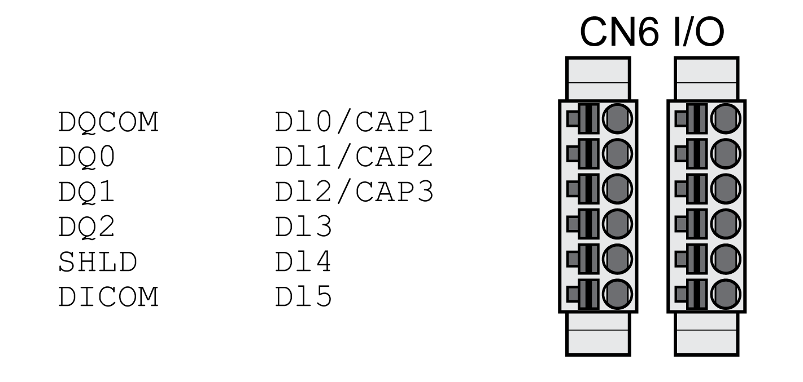

# Connection Digital Inputs and Outputs (CN6)

## General

The device has configurable inputs and configurable outputs. The standard assignment and the configurable assignment depend on the selected operating mode. For more information, see [Digital Signal Inputs and Digital Signal Outputs](DigitalSignalInputsAndDigitalSignal-C50B3C34.html#DigitalSignalInputsAndDigitalSignal-C50B3C34).

## Cable Specifications

|  |  |
| --- | --- |
| Shield: | - |
| Twisted Pair: | - |
| PELV: | Required |
| Cable composition: | 0.25 mm2, (AWG 22) |
| Maximum cable length: | 30 m (98.4 ft) |

## Properties of Connection Terminals CN6

| Characteristic | Unit | Value |
| --- | --- | --- |
| Connection cross section | mm2  (AWG) | 0.2 ... 1.0  (24 ... 16) |
| Stripping length | mm  (in) | 10  (0.39) |

## Wiring Diagram

| Signal | Meaning |
| --- | --- |
| DQCOM | Reference potential to DQ0 ... DQ2 |
| DQ0 | Digital output 0 |
| DQ1 | Digital output 1 |
| DQ2 | Digital output 2 |
| SHLD | Shield connection |
| DICOM | Reference potential to DI0 ... DI5 |
| DI0/CAP1 | Digital input 0 / Capture input 1 |
| DI1/CAP2 | Digital input 1 / Capture input 2 |
| DI2/CAP3(1) | Digital input 2 / Capture input 3(1) |
| DI3 | Digital input 3 |
| DI4 | Digital input 4 |
| DI5 | Digital input 5 |
| **(1)** Available with hardware version ≥RS03 | |

The connectors are coded. Verify correct assignment when connecting them.

The configuration and the standard assignment of the inputs and outputs are described in section [Digital Signal Inputs and Digital Signal Outputs](DigitalSignalInputsAndDigitalSignal-C50B3C34.html#DigitalSignalInputsAndDigitalSignal-C50B3C34).

## Connecting the Digital Inputs/Outputs

* Wire the digital connections to CN6.
* Ground the shield to SHLD.
* Verify that the connector locks snap in properly.

0198441114060.03

© 2021

Schneider Electric.

All rights reserved.