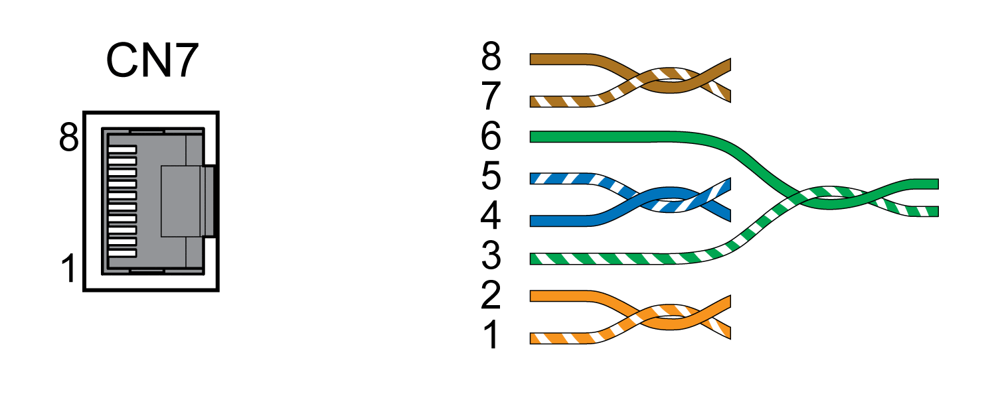

# Connection PC with Commissioning Software (CN7)

## General

A PC with the commissioning software Lexium DTM Library can be connected for commissioning. The PC is connected via a bidirectional USB/RS485 converter, see [Accessories and Spare Parts](AccessoriesAndSpareParts-C17F0DA3.html#AccessoriesAndSpareParts-C17F0DA3).

If the commissioning interface at the product is directly connected to an Ethernet interface at the PC, the PC interface may be damaged and rendered inoperable.

| NOTICE | |
| --- | --- |
|  | DAMAGE TO PC  * Use a bidirectional RJ45/USB-A adapter with an RS485/USB converter to connect to a PC. * Do not directly connect an Ethernet interface to the commissioning interface of this product.  Failure to follow these instructions can result in equipment damage. |

## Cable Specifications

|  |  |
| --- | --- |
| Shield: | Required, both ends grounded |
| Twisted Pair: | Required |
| PELV: | Required |
| Cable composition: | 8 \* 0.25 mm2 (8 \* AWG 22) |
| Maximum cable length: | 100 m (328 ft) |

## Wiring Diagram

| Pin | Signal | Meaning |
| --- | --- | --- |
| 1 ... 3 | - | Reserved |
| 4 | MOD\_D1 | RS485, Bidirectional transmit/receive signal |
| 5 | MOD\_D0 | RS485, Bidirectional transmit/receive signal, inverted |
| 6 | - | Reserved |
| 7 | MOD+10V\_OUT | 10 V supply, maximum 100 mA |
| 8 | MOD\_0V | Reference potential to MOD+10V\_OUT |

| WARNING | |
| --- | --- |
|  | UNINTENDED EQUIPMENT OPERATION  Do not connect any wiring to reserved, unused connections, or to connections designated as No Connection (N.C.).  Failure to follow these instructions can result in death, serious injury, or equipment damage. |

Verify that the connector locks snap in properly.

0198441114060.03

© 2021

Schneider Electric.

All rights reserved.