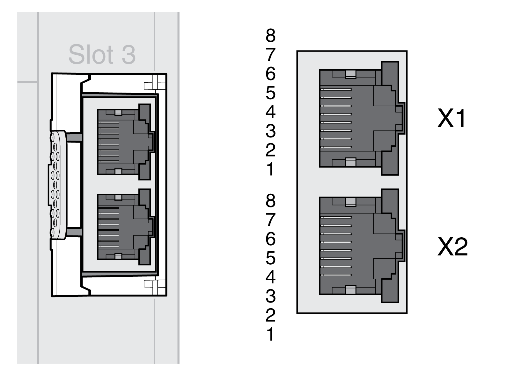

# Connection SERCOS III

## Cable Specifications

|  |  |
| --- | --- |
| Shield: | Required, both ends grounded |
| Twisted Pair: | Required |
| PELV: | Required |
| Cable composition: | 4 \* 0.14 mm2 (AWG 24) |
| Connector type: | RJ45 |

Use pre-assembled cables to reduce the risk of wiring errors, see chapter [Accessories and Spare Parts](AccessoriesAndSpareParts-C17F0DA3.html#AccessoriesAndSpareParts-C17F0DA3).

## Wiring Diagram

| Pin | Signal | Meaning |
| --- | --- | --- |
| 1 | Tx+ | Ethernet transmit signal + |
| 2 | Tx- | Ethernet transmit signal - |
| 3 | Rx+ | Ethernet receive signal + |
| 4 ... 5 | - | Reserved |
| 6 | Rx- | Ethernet receive signal - |
| 7 ... 8 | - | Reserved |

| WARNING | |
| --- | --- |
|  | UNINTENDED EQUIPMENT OPERATION  Do not connect any wiring to reserved, unused connections, or to connections designated as No Connection (N.C.).  Failure to follow these instructions can result in death, serious injury, or equipment damage. |

Verify that the connector locks snap in properly.

0198441114060.03

© 2021

Schneider Electric.

All rights reserved.