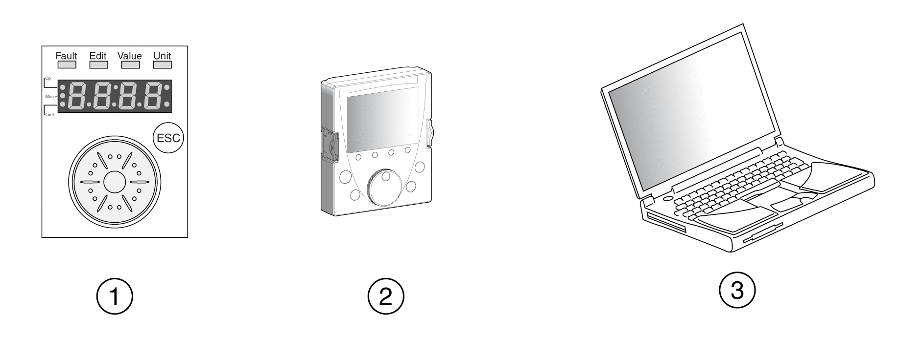
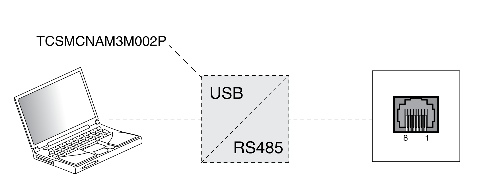

# Preparation

## Required Components

The following is required for commissioning:

* Commissioning software “Lexium DTM Library”

  [https://www.se.com/ww/en/download/document/Lexium\_DTM\_Library/](https://www.se.com/ww/en/download/document/Lexium_DTM_Library)
* Fieldbus converter for the commissioning software for connection via the commissioning interface

## Interfaces

The following interfaces can be used for commissioning, parameterization and diagnostics:

**1** Integrated HMI

**2** External graphic display terminal

**3** PC with commissioning software “Lexium DTM Library”

Device settings can be duplicated. Stored device settings can be transferred to a device of the same type. Duplicating the device settings can be used if multiple devices are to have the same settings, for example, when devices are replaced.

## Commissioning Software

The commissioning software “Lexium DTM Library” has a graphic user interface and is used for commissioning, diagnostics and testing settings.

* Tuning of the control loop parameters via a graphical user interface
* Comprehensive set of diagnostics tools for optimization and maintenance
* Long-term trace for evaluation of the performance
* Testing the input and output signals
* Tracking signals on the screen
* Archiving of device settings and recordings with export function for further processing in other applications

## Connecting a PC

A PC with commissioning software can be connected for commissioning. The PC is connected to a bidirectional USB/RS485 converter, see [Accessories and Spare Parts](AccessoriesAndSpareParts-C17F0DA3.html#AccessoriesAndSpareParts-C17F0DA3).

0198441114060.03

© 2021

Schneider Electric.

All rights reserved.