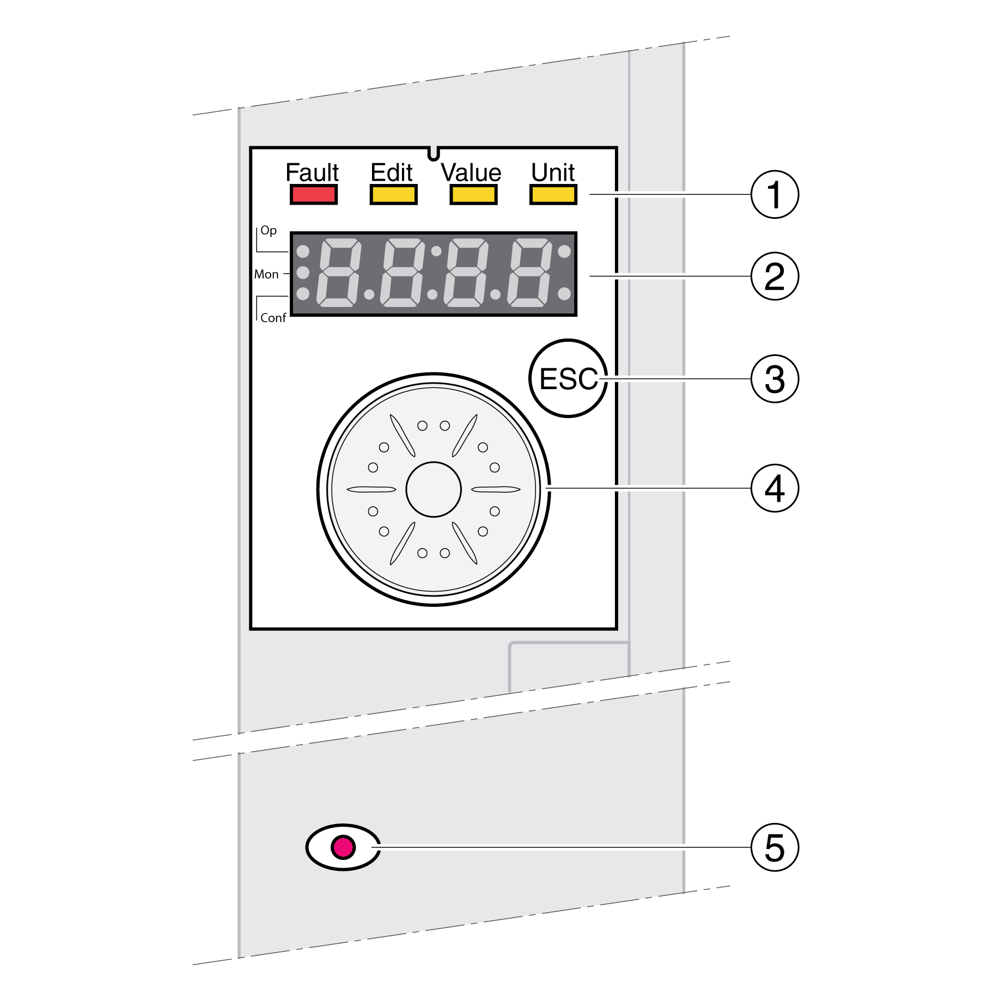
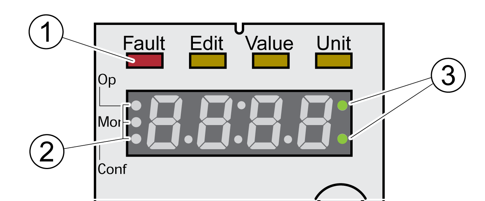
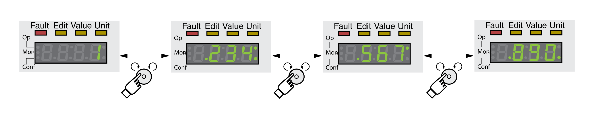

# Overview of Integrated HMI

## Overview

The device allows you to edit parameters, start the operating mode Jog or perform autotuning via the integrated Human-Machine Interface (HMI). Diagnostics information (such as parameter values or error codes) can also be displayed. The individual sections on commissioning and operation include information on whether a function can be carried out via the integrated HMI or whether the commissioning software must be used.

**1** Status LEDs

**2** 7-segment display

**3** ESC key

**4** Navigation button

**5** Red LED on: Voltage present at DC bus

Status LEDs and a 4-digit 7-segment display indicate the device status, menu designation, parameter codes, status codes and error codes. By turning the navigation button, you can select menu levels and parameters and increment or decrement values. To confirm a selection, press the navigation button.

The ESC (Escape) button allows you to exit parameters and menus. If values are displayed, the ESC button lets you return to the last saved value.

## Character Set on the HMI

The following table shows the assignment of the characters to the symbols displayed by the 4-digit 7-segment display.

|  |  |  |  |  |  |  |  |  |  |  |  |  |  |  |  |  |  |
| --- | --- | --- | --- | --- | --- | --- | --- | --- | --- | --- | --- | --- | --- | --- | --- | --- | --- |
| A | B | C | D | E | F | G | H | I | J | K | L | M | N | O | P | Q | R |
| **(**A**)** | **(**B**)** | **(**cC**)** | **(**D**)** | **(**E**)** | **(**F**)** | **(**G**)** | **(**H**)** | **(**i**)** | **(**J**)** | **(**K**)** | **(**L**)** | **(**M**)** | **(**N**)** | **(**o**)** | **(**P**)** | **(**Q**)** | **(**R**)** |
|  |  |  |  |  |  |  |  |  |  |  |  |  |  |  |  |  |  |
| S | T | U | V | W | X | Y | Z | 1 | 2 | 3 | 4 | 5 | 6 | 7 | 8 | 9 | 0 |
| **(**S**)** | **(**T**)** | **(**u**)** | **(**V**)** | **(**W**)** | **(**X**)** | **(**Y**)** | **(**Z**)** | **(**1**)** | **(**2**)** | **(**3**)** | **(**4**)** | **(**5**)** | **(**6**)** | **(**7**)** | **(**8**)** | **(**9**)** | **(**0**)** |

## Indication of the Device Status

**1** Four status LEDs

**2** Three status LEDS for identification of the menu levels

**3** Flashing dots indicate an error of error class 0

1: Four status LEDs are located above the 7-segment display:

| Fault | Edit | Value | Unit | Meaning |
| --- | --- | --- | --- | --- |
| Red | - | - | - | Operating state Fault |
| - | Yellow | Yellow | - | Parameter value can be edited |
| - | - | Yellow | - | Value of the parameter |
| - | - | - | Yellow | Unit of the selected parameter |

2: Three status LEDS for identification of the menu levels:

| LED | Meaning |
| --- | --- |
| Op | Operation |
| Mon | Status information |
| Conf | Configuration |

3: Flashing dots indicate an error of error class 0, for example, if a limit value has been exceeded.

## Display of Values

The HMI can directly display values up to 999.

Values greater than 999 are displayed in ranges of 1000. Turn the navigation button to select one of the ranges.

Example: Value 1234567890

## Navigation Button

The navigation button can be turned and pressed. There are two types of pressing: brief pressing (≤1 s) and long pressing (≥3 s).

**Turn** the navigation button to do the following:

* Go to the next or previous menu
* Go to the next or previous parameter
* Increment or decrement values
* Switch between ranges in the case of values greater than 999

Briefly **press** the navigation button to do the following:

* Call the selected menu
* Call the selected parameter
* Save the value to the nonvolatile memory

**Hold down**  the navigation button to do the following:

* Display a description of the selected parameter
* Display the unit of the selected parameter

0198441114060.03

© 2021

Schneider Electric.

All rights reserved.