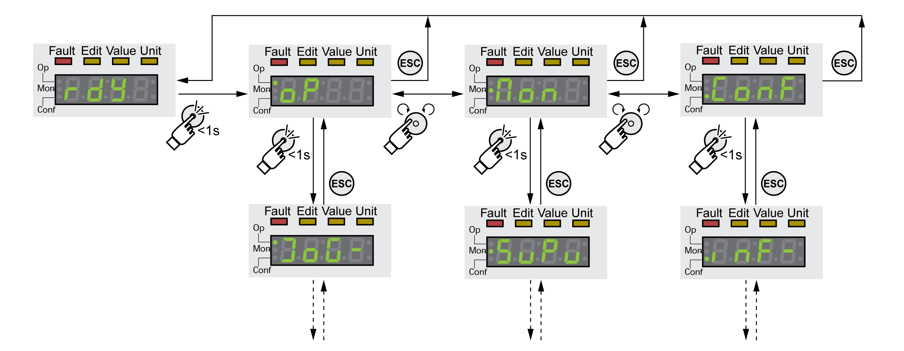

# Menu Structure

## Description

The integrated HMI is menu-driven. The following illustration shows the top level of the menu structure.

The level below the top level contains the parameters belonging to the respective menu items. To facilitate access, the parameter tables also specify the menu path, for example **(**op**)**→**(**jog-**)**.

0198441114060.03

© 2021

Schneider Electric.

All rights reserved.