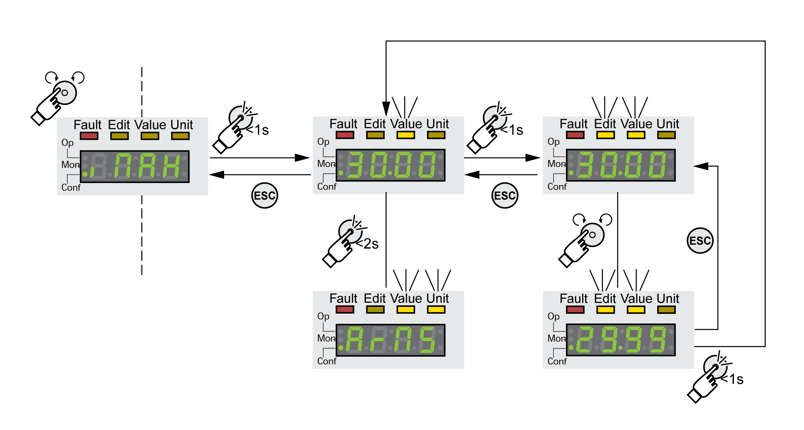

# Setting Parameters

## Displaying and Setting Parameters

The figure below shows an example of displaying a parameter (second level) and entering or selecting a parameter value (third level).

* Go to the parameter **(**imax**)** (iMax).
* Press the navigation button for a longer period of time to display a parameter description.

  The parameter description is displayed in the form of horizontally scrolling text.
* Briefly press the navigation button to display the value of the selected parameter.

  The LED Value illuminates and the parameter value is displayed.
* Press the navigation button for a longer period of time to display the unit of the parameter value.

  As long as the navigation button is held down, the status LEDs Value and Unit illuminate. The unit of the parameter value is displayed. Once you release the navigation button, the parameter value is displayed again.
* Press the navigation button to modify the value of the parameter.

  The status LEDs Edit and Value illuminate and the parameter value is displayed.
* Turn the navigation button to modify the value of the parameter. The increments and the limit value for each parameter are pre-defined.
* Briefly press the navigation button to save the modified parameter value.

  If you do not want to save the modified parameter value, press the ESC button to cancel. The display returns to the original value of the parameter.

  The displayed modified value of the parameter flashes once and is written to the nonvolatile memory.
* Press ESC to return to the menu

## Information to be Displayed During Motor Movements

By default, the 7-segment display displays the operating state during motor movements.

You can select the type of information to be displayed during motor movements via the menu item **(**MON**)** / **(**supv**)**:

* **(**stat**)** displays the operating state (default)
* **(**vact**)** displays the actual velocity of the motor
* **(**iact**)** displays the actual torque of the motor

The modified value of the parameter is only taken into account at motor standstill.

0198441114060.03

© 2021

Schneider Electric.

All rights reserved.