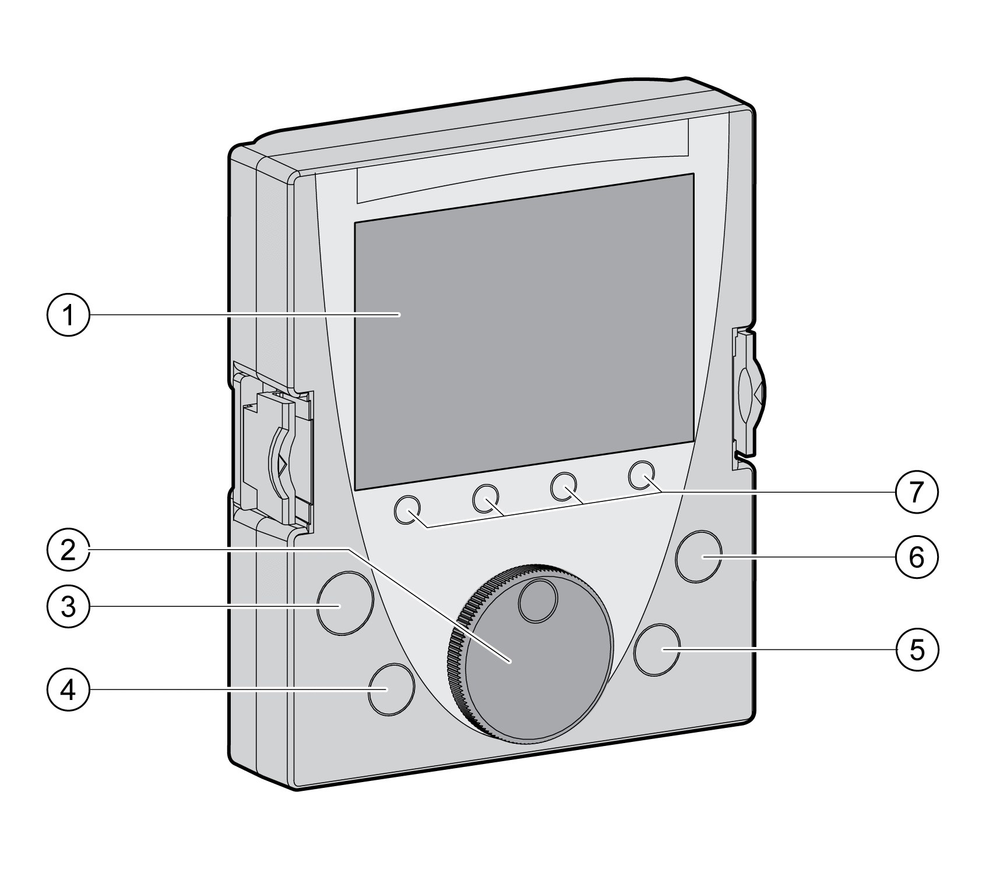
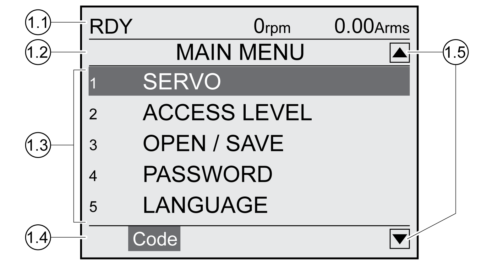

# Display and Controls

## Overview

The external graphic display terminal is designed only for commissioning drives.

**1** Display field

**2** Navigation button

**3** STOP/RESET key

**4** RUN key

**5** FWD/REV key

**6** ESC key

**7** Function keys F1 ... F4

Depending on the firmware version of the external graphic display terminal, the information may be represented differently. Use the most up-to-date firmware version.

## Display Field (1)

The display is subdivided into 5 areas.

Display of the graphic display terminal (example shows English language)

**1.1** Status information of the drive

**1.2** Menu bar

**1.3** Data field

**1.4** Function bar

**1.5** Navigation

## Status Information of the Drive (1.1)

This line displays the operating state, the actual velocity and the actual current of the motor. If an error has been detected, the error code is displayed.

## Menu Bar (1.2)

The menu bar displays the name of the menu.

## Data Field (1.3)

The following information can be displayed and values entered in the data field:

* Submenus
* Operating Mode
* Parameters and parameter values
* State of movement
* Error messages

## Function Bar (1.4)

The function bar displays the name of the function that is triggered when you press the corresponding function key. Example: Pressing the F1 function key displays the "Code". If you press F1, the HMI name of the displayed parameter is shown.

## Navigation (1.5)

Arrows indicate that additional information is available that can be displayed by scrolling.

## Navigation Button (2)

By turning the navigation button, you can select menu levels and parameters and increment or decrement values. To confirm a selection, press the navigation button.

## Key STOP/RESET (3)

The key STOP/RESET terminates a movement by means of a Quick Stop.

## Key RUN (4)

The key RUN allows you to start a movement.

## Key FWD/REV (5)

The key FWD/REV allows you to reverse the direction of movement.

## Key ESC (6)

The ESC (Escape) button allows you to exit parameters and menus or cancel a movement. If values are displayed, the ESC key lets you return to the last saved value.

## Function Keys F1 ... F4 (7)

The function bar displays the name of the function triggered when the corresponding function key is pressed.

0198441114060.03

© 2021

Schneider Electric.

All rights reserved.