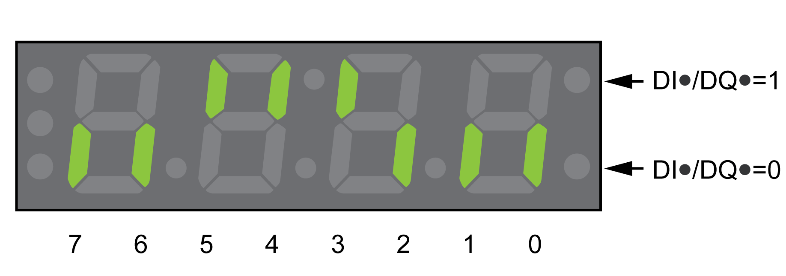

# Digital Inputs and Outputs

## General

The device has configurable inputs and configurable outputs. See section [Digital Signal Inputs and Digital Signal Outputs](DigitalSignalInputsAndDigitalSignal-C50B3C34.html#DigitalSignalInputsAndDigitalSignal-C50B3C34) for additional information.

The signal states of the digital inputs and digital outputs can be displayed on the HMI and via the fieldbus.

## Integrated HMI

The signal states can be displayed on the integrated HMI, but they cannot be modified.

**Inputs** (parameter \_IO\_DI\_act):

Open the menu item **(**-MON**)** → **(**dimo**)**.

The digital inputs are displayed in a bit-coded way.

| Bit | Signal |
| --- | --- |
| 0 | DI0 |
| 1 | DI1 |
| 2 | DI2 |
| 3 | DI3 |
| 4 | DI4 |
| 5 | DI5 |
| 6 ... 7 | - |

The parameter \_IO\_DI\_act does not display the states of the inputs of the safety function STO. Use the parameter \_IO\_STO\_act to visualize the states of the inputs of the safety function STO.

**Outputs** (parameter \_IO\_DQ\_act):

Open the menu item **(**-MON**)** → **(**domo**)**.

The digital outputs are displayed in a bit-coded way.

| Bit | Signal |
| --- | --- |
| 0 | DQ0 |
| 1 | DQ1 |
| 2 | DQ2 |
| 3 ... 7 | - |

## Fieldbus

The signal states are contained in the parameter \_IO\_act in a bit-coded way. The values "1" and "0" correspond to the signal state of the input or output.

| Parameter name  HMI menu  HMI name | Description | Unit  Minimum value  Factory setting  Maximum value | Data type  R/W  Persistent  Expert | Parameter address via fieldbus |
| --- | --- | --- | --- | --- |
| \_IO\_act | Physical status of the digital inputs and outputs.  Low byte:  Bit 0: DI0  Bit 1: DI1  Bit 2: DI2  Bit 3: DI3  Bit 4: DI4  Bit 5: DI5  High byte:  Bit 8: DQ0  Bit 9: DQ1  Bit 10: DQ2  Type: Unsigned decimal - 2 bytes | -  -  -  - | UINT16  R/-  -  - | Modbus 2050  IDN P-0-3008.0.1 |
| \_IO\_DI\_act  ****(Mon)****  ****(diMo)**** | Status of digital inputs.  Bit assignments:  Bit 0: DI0  Bit 1: DI1  Bit 2: DI2  Bit 3: DI3  Bit 4: DI4  Bit 5: DI5  Type: Unsigned decimal - 2 bytes | -  -  -  - | UINT16  R/-  -  - | Modbus 2078  IDN P-0-3008.0.15 |
| \_IO\_DQ\_act  ****(Mon)****  ****(doMo)**** | Status of digital outputs.  Bit assignments:  Bit 0: DQ0  Bit 1: DQ1  Bit 2: DQ2  Type: Unsigned decimal - 2 bytes | -  -  -  - | UINT16  R/-  -  - | Modbus 2080  IDN P-0-3008.0.16 |
| \_IO\_STO\_act  ****(Mon)****  ****( Sto)**** | Status of the inputs for the safety-related function STO.  Bit 0: STO\_A  Bit 1: STO\_B  If no safety module eSM is inserted, this parameter indicates the status of the signal inputs STO\_A and STO\_B.  If a safety module eSM is inserted, the safety function STO can be triggered via the signal inputs or via the safety module eSM. This parameter indicates whether or not the safety function STO was triggered (regardless of whether it was triggered via the signal inputs or via the safety module eSM).  Type: Unsigned decimal - 2 bytes | -  -  -  - | UINT16  R/-  -  - | Modbus 2124  IDN P-0-3008.0.38 |

0198441114060.03

© 2021

Schneider Electric.

All rights reserved.