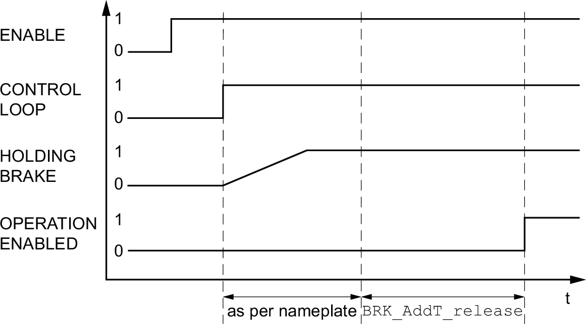
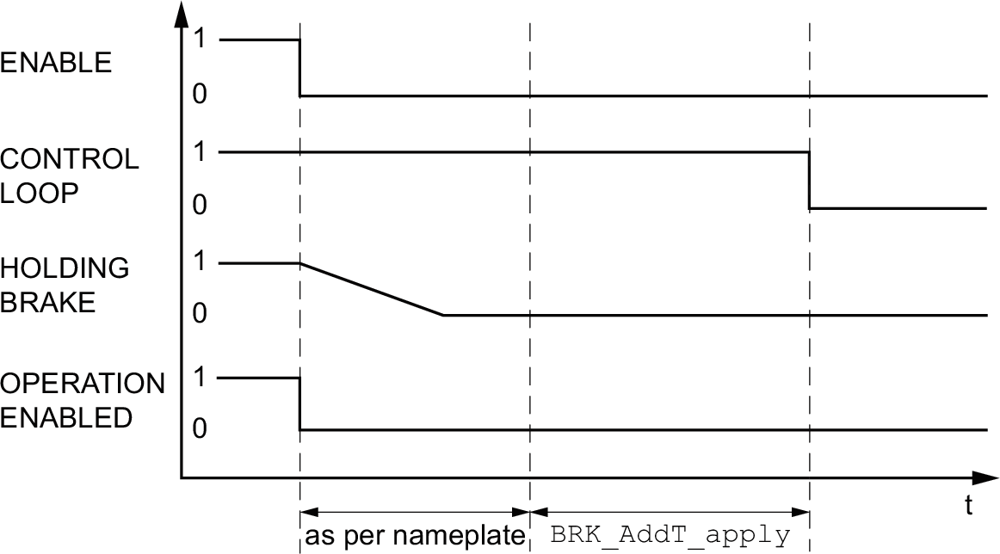

# Holding Brake (Option)

## Holding Brake

The holding brake in the motor has the task of holding the motor position when the power stage is disabled. The holding brake is not a safety function and not a service brake.

| WARNING | |
| --- | --- |
|  | UNINTENDED AXIS MOVEMENT  * Do not use the internal holding brake as a safety-related measure. * Only use certified external brakes as safety-related measures.  Failure to follow these instructions can result in death, serious injury, or equipment damage. |

## Releasing the Holding Brake

When the power stage is enabled, current is applied to the motor. When current is applied to the motor, the holding brake is automatically released.

Releasing the holding brake requires a certain amount of time. This time is contained in the electronic nameplate of the motor. Transition to the operating state **6** Operation Enabled is only possible after this time delay has elapsed.

An additional time delay can be set via parameters, see [Additional Time Delay for Releasing the Holding Brake](#HoldingBrakeOption-C41EF4AE__AdditionalTimeDelayForReleasingTheH-C41E886F).

## Applying the Holding Brake

When the power stage is disabled, the holding brake is automatically applied.

However, applying the holding brake requires a certain amount of time. This time is contained in the electronic nameplate of the motor. Current remains to be applied to the motor during this time delay.

See section [Functional Safety](FunctionalSafety-C41F7D55.html#FunctionalSafety-C41F7D55) for additional information on the behavior of the holding brake when the safety function STO is triggered.

An additional time delay can be set via parameters, see [Additional Time Delay for Applying the Holding Brake](#HoldingBrakeOption-C41EF4AE__AdditionalTimeDelayForApplyingTheHo-C41E8A05).

## Additional Time Delay for Releasing the Holding Brake

An additional time delay can be set via the parameter BRK\_AddT\_release.

Transition to the operating state **6** Operation Enabled is only possible after the entire time delay has elapsed.

| Parameter name  HMI menu  HMI name | Description | Unit  Minimum value  Factory setting  Maximum value | Data type  R/W  Persistent  Expert | Parameter address via fieldbus |
| --- | --- | --- | --- | --- |
| BRK\_AddT\_release | Additional time delay for releasing the holding brake.  The overall time delay for releasing the holding brake is the time delay from the electronic nameplate of the motor and the additional time delay in this parameter.  Type: Signed decimal - 2 bytes  Write access via Sercos: CP2, CP3, CP4  Setting can only be modified if power stage is disabled.  Modified settings become active the next time the power stage is enabled. | ms  0  0  400 | INT16  R/W  per.  - | Modbus 1294  IDN P-0-3005.0.7 |

## Additional Time Delay for Applying the Holding Brake

An additional time delay can be set via the parameter BRK\_AddT\_apply.

Current continues to be applied to the motor until the entire time delay has passed.

| Parameter name  HMI menu  HMI name | Description | Unit  Minimum value  Factory setting  Maximum value | Data type  R/W  Persistent  Expert | Parameter address via fieldbus |
| --- | --- | --- | --- | --- |
| BRK\_AddT\_apply | Additional time delay for applying the holding brake.  The overall time delay for applying the holding brake is the time delay from the electronic nameplate of the motor and the additional time delay in this parameter.  Type: Signed decimal - 2 bytes  Write access via Sercos: CP2, CP3, CP4  Setting can only be modified if power stage is disabled.  Modified settings become active the next time the power stage is enabled. | ms  0  0  1000 | INT16  R/W  per.  - | Modbus 1296  IDN P-0-3005.0.8 |

## Verifying the Function of the Holding Brake

The device is in the operating state **4** Ready To Switch On.

| Step | Action |
| --- | --- |
| 1 | Start the operating mode Jog (HMI: **(**op**)**→**(**JOg**)**→**(**JGST**)**).  The power stage is enabled and the holding brake released. The HMI displays **(**JG-**)**. |
| 2 | If the holding brake has been released, hold down the navigation button. Then press ESC.  As long as the navigation button is held down, the motor moves. When you press ESC, the holding brake is applied again and the power stage is disabled. |
| 3 | If the holding brake is not released, press ESC.  When you press ESC, the power stage is disabled. |
| 4 | Verify the wiring if the behavior of the holding brake is not correct. |

## Releasing the Holding Brake Manually

Mechanical adjustments may require you to manually rotate the motor shaft.

Manual release of the holding brake is only possible in the operating states **3** Switch On Disabled, **4** Ready To Switch On or **9** Fault.

When the product is operated for the first time, there is a risk of unanticipated movements caused by, for example, incorrect wiring or unsuitable parameter settings. Releasing the holding brake can cause an unintended movement, for example, a falling load in the case of vertical axes.

| WARNING | |
| --- | --- |
|  | UNINTENDED MOVEMENT  * Verify that there are no persons or obstructions in the zone of operation when operating the system. * Take appropriate measures to avoid hazards caused by falling or lowering loads or other unintended movements. * Run initial tests without coupled loads. * Verify that a functioning emergency stop push-button is within reach of all persons involved in running tests. * Anticipate movements in unintended directions or oscillations of the motor.  Failure to follow these instructions can result in death, serious injury, or equipment damage. |

## Applying the Holding Brake Manually

For testing the holding brake, you may want to manually apply the holding brake.

You can only apply the holding brake manually when the motor is at a standstill.

If you enable the power stage after the holding brake has been applied manually, the holding brake remains applied.

Manual application of the holding brake has priority over automatic and manual release of the holding brake.

If a movement is started after the holding brake has been applied manually, this can cause wear.

| NOTICE | |
| --- | --- |
|  | BRAKE WEAR AND LOSS OF BRAKING TORQUE  * Verify that the generated motor torque is not greater than the holding torque of the holding brake if you have applied the holding brake manually. * Only apply the holding brake manually for the purpose of testing the holding brake.  Failure to follow these instructions can result in equipment damage. |

As of firmware version ≥V01.04, you can manually apply the holding brake.

## Releasing the Holding Brake Manually via a Signal Input

In order to release the holding brake via a signal input, you must first parameterize the signal input function "Release Holding Brake", see [Digital Signal Inputs and Digital Signal Outputs](DigitalSignalInputsAndDigitalSignal-C50B3C34.html#DigitalSignalInputsAndDigitalSignal-C50B3C34).

## Releasing or Applying the Holding Brake Manually via the Fieldbus

The parameter BRK\_release can be used to release the holding brake via the fieldbus.

| Parameter name  HMI menu  HMI name | Description | Unit  Minimum value  Factory setting  Maximum value | Data type  R/W  Persistent  Expert | Parameter address via fieldbus |
| --- | --- | --- | --- | --- |
| BRK\_release | Manual operation of the holding brake.  **0 / Automatic**: Automatic processing  **1 / Manual Release**: Manual release of holding brake  **2 / Manual Application**: Manual applying of holding brake  You can apply or release the holding brake manually.  The holding brake can only be manually released in the operating states 'Switch On Disabled', 'Ready To Switch On' or 'Fault'.  If you have applied the holding brake manually and then want to release it manually, you must first set this parameter to Automatic and then to Manual Release.  Type: Unsigned decimal - 2 bytes  Write access via Sercos: CP2, CP3, CP4  Modified settings become active immediately. | -  0  0  2 | UINT16  R/W  -  - | Modbus 2068  IDN P-0-3008.0.10 |

0198441114060.03

© 2021

Schneider Electric.

All rights reserved.