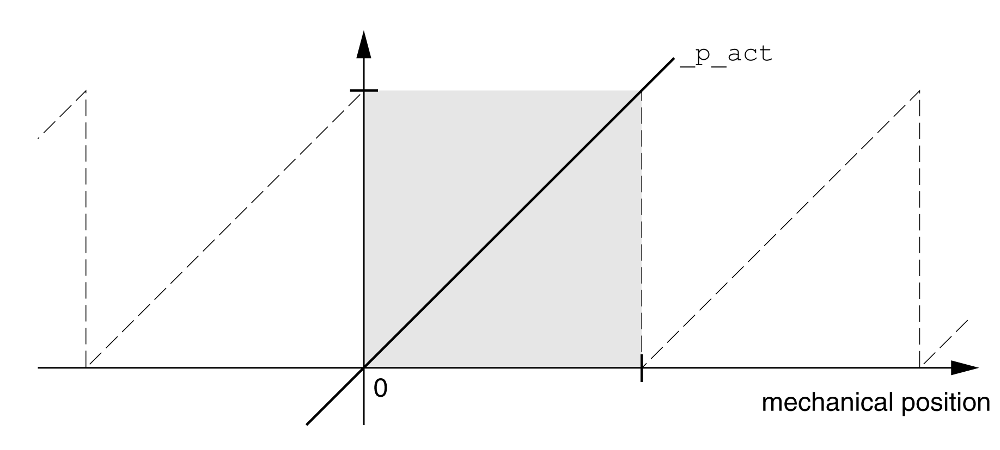
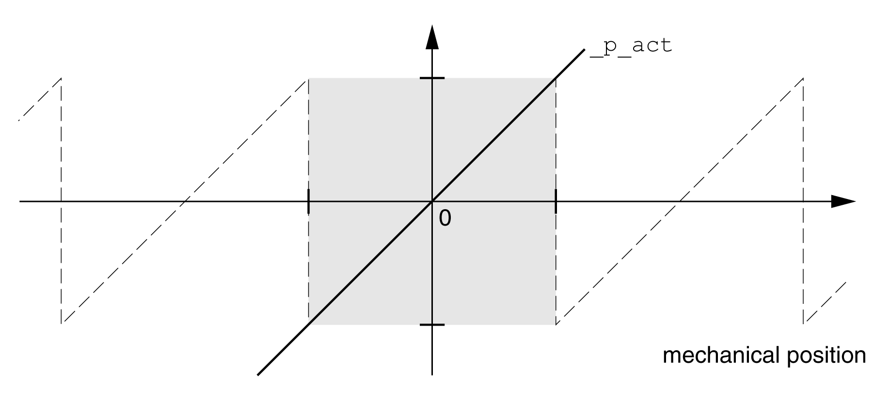

# Setting Parameters for Encoder

## General

When starting up, the device reads the absolute position of the motor from the encoder. The absolute position can be read with the parameter \_p\_absENC.

NOTE: Values for positions, velocities, acceleration and deceleration are specified in the following user-defined unit:

* usr\_p for positions
* usr\_v for velocities
* usr\_a for acceleration and deceleration

| Parameter name  HMI menu  HMI name | Description | Unit  Minimum value  Factory setting  Maximum value | Data type  R/W  Persistent  Expert | Parameter address via fieldbus |
| --- | --- | --- | --- | --- |
| \_p\_absENC  ****(Mon)****  ****(PAMu)**** | Absolute position with reference to the encoder range.  This value corresponds to the modulo position of the absolute encoder range.  The value is no longer valid if the gear ratio of machine encoder and motor encoder is changed. A restart is required in such a case.  Type: Unsigned decimal - 4 bytes | usr\_p  -  -  - | UINT32  R/-  -  - | Modbus 7710  IDN P-0-3030.0.15 |

## Working Range of the Encoder

The working range of the singleturn encoder is 131072 increments per turn.

The working range of the multiturn encoder is 4096 turns with 131072 increments per turn.

## Underrun of Absolute Position

If a motor performs a movement from 0 into negative direction, there is an underrun of the absolute position of the encoder. However, the actual position keeps counting forward and delivers a negative position value. After a power cycle, the actual position no longer corresponds to the negative position value, but to the absolute position of the encoder.

The following options are available to adjust the absolute position of the encoder:

* Adjustment of the absolute position
* Shifting the working range

## Adjustment of the Absolute Position

When the motor is at a standstill, the new absolute position of the motor can be set to the current mechanical motor position the with the parameter ENC1\_adjustment.

Adjusting the absolute position also shifts the position of the index pulse.

The absolute position of an encoder at encoder 2 (module) can be adjusted via the parameter ENC2\_adjustment.

Procedure:

Set the absolute position at the negative mechanical limit to a position value greater than 0. This way, the movements remain within the continuous range of the encoder.

| Parameter name  HMI menu  HMI name | Description | Unit  Minimum value  Factory setting  Maximum value | Data type  R/W  Persistent  Expert | Parameter address via fieldbus |
| --- | --- | --- | --- | --- |
| ENC1\_adjustment | Adjustment of absolute position of encoder 1.  The value range depends on the encoder type.  Singleturn encoder:  0 ... x-1  Multiturn encoder:  0 ... (4096\*x)-1  Singleturn encoder (shifted with parameter ShiftEncWorkRang):  -(x/2) ... (x/2)-1  Multiturn encoder (shifted with parameter ShiftEncWorkRang):  -(2048\*x) ... (2048\*x)-1  Definition of 'x': Maximum position for one encoder turn in user-defined units. This value is 16384 with the default scaling.  If processing is to be performed with inversion of the direction of movement, this must be set before the encoder position is adjusted.  After the write access, a wait time of at least 1 second is required before the drive can be powered off.  Type: Signed decimal - 4 bytes  Write access via Sercos: CP2, CP3, CP4  Modified settings become active the next time the product is powered on. | usr\_p  -  -  - | INT32  R/W  -  - | Modbus 1324  IDN P-0-3005.0.22 |
| ENC2\_adjustment | Adjustment of absolute position of encoder 2.  The value range depends on the encoder type at the physical port ENC2.  This parameter can only be changed if the parameter ENC\_abs\_source is set to 'Encoder 2'.  Singleturn encoder:  0 … x-1  Multiturn encoder:  0 … (y\*x)-1  Singleturn encoder (shifted with parameter ShiftEncWorkRang):  -(x/2) … (x/2)-1  Multiturn encoder (shifted with parameter ShiftEncWorkRang):  -(y/2)\*x … ((y/2)\*x)-1  Definition of 'x': Maximum position for one encoder turn in user-defined units. This value is 16384 with the default scaling.  Definition of 'y': Revolutions of the multiturn encoder.  If processing is to be performed with inversion of the direction of movement, this must be set before the encoder position is adjusted.  After the write access, the parameter values have to be saved to the nonvolatile memory and the drive has to be powered off, before the change becomes active.  Type: Signed decimal - 4 bytes  Write access via Sercos: CP2, CP3, CP4  Modified settings become active the next time the product is powered on. | usr\_p  -  -  - | INT32  R/W  -  - | Modbus 1352  IDN P-0-3005.0.36 |

## Shifting the Working Range

The parameter ShiftEncWorkRang lets you shift the working range.

The working range without shift comprises:

|  |  |
| --- | --- |
| Singleturn encoder | 0 ... 131071 increments |
| Multiturn encoder | 0 ... 4095 revolutions |

The working range with shift comprises:

|  |  |
| --- | --- |
| Singleturn encoder | -65536 ... 65535 increments |
| Multiturn encoder | -2048 ... 2047 revolutions |

| Parameter name  HMI menu  HMI name | Description | Unit  Minimum value  Factory setting  Maximum value | Data type  R/W  Persistent  Expert | Parameter address via fieldbus |
| --- | --- | --- | --- | --- |
| ShiftEncWorkRang | Shifting of the encoder working range.  **0 / Off**: Shifting off  **1 / On**: Shifting on  After activating the shifting function, the position range of a multiturn encoder is shifted by one half of the range.  Example for the position range of a multiturn encoder with 4096 revolutions:  Value 0: Position values are between 0 … 4096 revolutions.  Value 1: Position values are between -2048 … 2048 revolutions.  Type: Unsigned decimal - 2 bytes  Write access via Sercos: CP2, CP3, CP4  Modified settings become active the next time the product is powered on. | -  0  0  1 | UINT16  R/W  per.  - | Modbus 1346  IDN P-0-3005.0.33 |

0198441114060.03

© 2021

Schneider Electric.

All rights reserved.